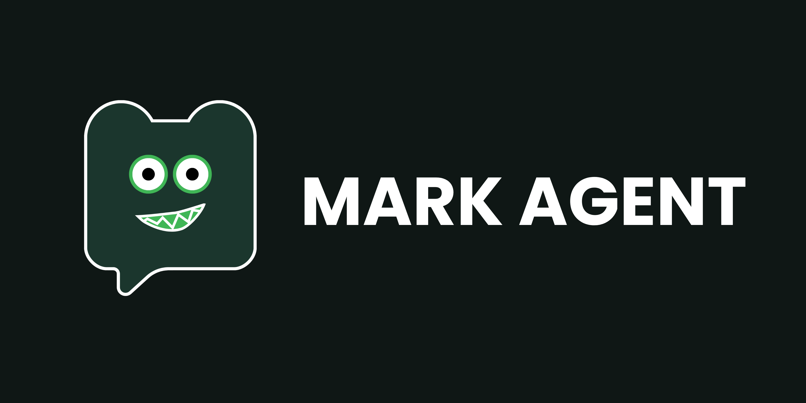

# MARK - Metacognitive Artificial Relational Knowledge (v5.0.0)


[](https://github.com/Mazees/mark-agent/releases/)

> **Mark BUKAN sekadar asisten virtual biasa. Mark adalah entitas AI yang dirancang untuk memiliki emosi, bertindak selayaknya manusia, dan memimpin tim agen cerdas.**
> Lebih dari sekadar chatbot kaku, Mark adalah _Personal AI OS Companion_ yang berjalan di ekosistem lokal Anda—dilengkapi dengan arsitektur modern **Node.js Core + WebUI (React 19 / Vite 7)** dalam antarmuka Microsoft Edge App Mode (dengan fallback otomatis ke browser default) dan CLI Live Activity Monitor (`mark`). Didukung oleh **Centralized SQLite Database**, sistem memori jangka panjang berbasis _Vector Memory_, **Relational Growth System**, **Autonomous Multi-Agent Sub-Agent Engine**, serta **Multi-Session Browser Automation**. Ditenagai oleh _Hybrid AI Engine_, Mark dapat beroperasi secara lokal untuk privasi maksimal, atau menggunakan _Cloud APIs_ untuk mengeksekusi tugas kompleks, menyusun rencana (_Agentic Planning_), mengotomatisasi desktop PC, merangkum video YouTube, mengobservasi layar atau dunia nyata (_Vision_), hingga kendali jarak jauh via **Telegram Bot**.

> [!IMPORTANT]
> Proyek ini dioptimalkan khusus untuk **Windows** (Windows 10/11 64-bit).

---

## Fitur Unggulan

- **Arsitektur Decoupled V5 (Node.js Core + Modern WebUI):** Inti aplikasi dipisahkan menjadi server Node.js performa tinggi (`src/server/`) dengan WebSocket Hub (`/stream`) dan antarmuka React 19 / Vite 7 (`src/renderer/`). Berjalan ringan dalam mode Microsoft Edge App Mode terisolasi (dengan fallback otomatis ke browser default) dan CLI Live Activity Monitor (`mark`).
- **Autonomous Multi-Agent Sub-Agent Engine (Mission Control):** Mark bertindak sebagai _Lead Agent_ yang mampu memecah tugas kompleks dan mendelegasikannya ke banyak **Sub-Agent spesialis** yang bekerja secara paralel di latar belakang. Dilengkapi dengan antarmuka **Mission Control** dan **Live Sub-Agent Intercom HUD** yang menampilkan pemikiran mendalam (_Reasoning Analisis_), langkah eksekusi berkala (_Execution Steps_), dan laporan hasil akhir dengan dukungan penuh Markdown & Syntax Highlighting.
- **Centralized SQLite & Real-Time Hybrid Vector Engine:** Seluruh data (memori kognitif, riwayat obrolan, turn pairs, konfigurasi, sub-agent, dan tasks) tersimpan terpusat di `%USERPROFILE%\.config\mark-agent\mark.db` menggunakan `better-sqlite3` dalam WAL mode berkecepatan tinggi. Diindeks secara _real-time_ ke mesin pencari hybrid `@orama/orama` menggunakan model embedding lokal 384-dimensi (`Xenova/paraphrase-multilingual-MiniLM-L12-v2`) via Transformers.js tanpa ketergantungan API luar.
- **Universal Zero-Hallucination Policy & Strict Groundedness:** Menerapkan kebijakan anti-halusinasi ketat di seluruh ekosistem Mark. Jika data riwayat percakapan lama, berkas kode, atau fakta dokumen tidak ditemukan, Mark wajib jujur mengakuinya dan dilarang keras mengarang informasi, menambah-nambahkan poin fiktif (_anti-extrapolation_), atau berpura-pura mengingat hal yang belum pernah dibahas.
- **Multi-Session Isolated Browser Automation:** Sistem browser Chromium fisik Mark mendukung sesi independen tanpa batas berbasis `puppeteer-core`. Beberapa Sub-Agent dapat melakukan riset web, menavigasi Google, mengekstrak data, dan mengisi formulir secara bersamaan tanpa saling mengganggu, didukung oleh **Multi-Card Holo Preview** yang menampilkan status visual tiap sesi di antarmuka desktop.
- **Dynamic Agentic Planning (ReAct Loop):** Mengganti sistem penjawab statis dengan arsitektur penalaran cerdas. Mark mampu memecah masalah, memikirkan strategi, menggunakan _tools_ secara otonom berulang kali, dan mengevaluasi hasilnya sebelum memberikan jawaban akhir yang komprehensif.
- **Agent Task Workflows (Durable Tasks & Mission Control):** Untuk pekerjaan multi-langkah yang panjang, Mark secara otonom mendekomposisi tugas menjadi tahapan konkret via tool `create_agent_task` (atau dipicu manual via perintah `/task` dan alias `/plan`). Setiap langkah divalidasi, di-checkpoint persisten ke basis data SQLite, dapat di-retry otomatis, dan menghasilkan berkas artefak markdown resmi di folder `Documents/Mark Tasks/<task-id>/` yang terpantau real-time pada komponen antarmuka `DurableTaskBubble` di chat stream.
- **Zero-Vision Physical PC & Desktop Automation (Windows UIAutomation + C# Daemon):** Menggunakan daemon PowerShell C# persisten (`pc-daemon.ps1`), Mark dapat membaca elemen GUI desktop secara struktural, mengklik koordinat, mengetik teks Unicode, menekan kombinasi _shortcut_, hingga mengelola jendela aplikasi di Windows secara fisik dengan kecepatan tinggi tanpa biaya vision API. Dilengkapi _Floating Security Banner_ dan tombol darurat **Emergency Stop (`Ctrl+Shift+S`)**.
- **Infinite Memory & Injection Knowledge RAG:** Sistem Vector Retrieval-Augmented Generation (RAG) berjalan secara _offline_. Mark menyimpan riwayat memori obrolan masif tanpa batas dan pengguna dapat menambahkan dokumen (.pdf, .docx, .txt, .md) ke dalam _knowledge base_ tanpa membebani _context window_ LLM.
- **Automatic Memory Groomer (Hippocampus Engine):** Sistem pembersihan dan konsolidasi memori mandiri berbasis _Orama Clustering_ dan _LLM Batch Processing_. Hippocampus Engine mendeteksi klaster memori serupa (`profile` & `preference`) lalu menggabungkannya secara kronologis tanpa kehilangan riwayat penting.
- **Visualisasi Jaringan Otak (Memory Visualizer):** Antarmuka _Live Feed_ "Mark Neural Core" berbasis grafis Neural Network 2D interaktif (`react-force-graph-2d`) untuk menjelajahi jaringan _Chat History_, _Knowledge Base_, hingga _Document Vault_.
- **Relational Growth System & Dynamic Persona:** Hubungan Anda dengan Mark dievaluasi layaknya manusia sungguhan melalui 4 parameter krusial (_Warmth, Sarcasm, Trust, Energy_). Tingkat kesopanan, kelancangan (_roasting_), dan kepribadian Mark akan berevolusi organik sesuai gaya komunikasi Anda.
- **Multi AI Provider (Built-in Gemini / Local / Cloud):** Mark hadir dengan **Google Gemini Engine (Gratis)** sebagai _provider_ bawaan yang siap pakai tanpa API Key. Anda juga memiliki fleksibilitas penuh untuk menggunakan **Local AI** (LM Studio), **Cloud AI** (Groq / Cerebras), maupun _Custom OpenAI-Compatible API_.
- **Asisten Bot Telegram Mandiri (Telegraf Engine):** Terhubung langsung dengan Telegram Bot API. Mark dapat dikontrol jarak jauh via Telegram, merangkum obrolan, mengunduh MP3 YouTube, mengambil tangkapan layar PC, dan secara otomatis menyinkronkan seluruh balasan & _Awareness Engine_ ke Telegram Admin secara _real-time_.
- **Proaktif dengan Awareness Engine:** Mark tidak hanya pasif merespons. Mark dapat proaktif menyapa, mengingatkan tugas, atau memutarkan musik di latar belakang saat Anda sedang bersantai atau bekerja fokus.

---

## Kemampuan Utama (Tools)

- **Autonomous Multi-Agent Tools:** `spawn_subagent`, `wait_subagents`, `send_message`, `list_subagents`, `kill_subagent`.
- **Durable Task Workflow Engine:** `create_agent_task` (pemecahan tugas multi-tahap terstruktur, checkpointing berkala, validasi kelayakan deliverable, dan generasi berkas artefak).
- **Memory & Recall Tools (`memory-search`):** Pencarian semantik memori, preferensi, catatan teknis, dan pasangan percakapan asli (Turn Pairs) dengan _similarity threshold_ dinamis (`keyword||threshold||limit`, default threshold `0.5`, limit `5`).
- **Multi-Session Web Browsing (`browser-*`):** `browser-navigate`, `browser-read`, `browser-click`, `browser-type`, `browser-scroll`, `browser-extract`, `browser-ask-user`, `browser-close`.
- **Desktop Automation (`os-*`):** `os-read`, `os-click`, `os-type`, `os-key`, `os-scroll`, `os-open`, `os-list-windows`, `os-focus-window`.
- **Native File Handling & PowerShell:** `read-file`, `write-file`, `replace-content`, `delete-file`, `list-dir`, `grep-search`, `run-powershell`.
- **Vision Awareness:** `analyze-screen` (analisis layar multi-monitor) dan `camera-look` (observasi visual webcam).
- **Interaksi Suara Natural:** Voice Activity Detection (VAD) dengan Groq Whisper STT / Local Whisper dan Edge-TTS (`id-ID-ArdiNeural`).
- **Perangkum YouTube & YouTube Music:** Transkripsi kilat video YouTube dan pemutar YouTube Music tanpa iklan dengan _ad-blaster_.
- **Mark Skills System:** Kustomisasi kepribadian dan kapabilitas menggunakan instruksi Markdown (`.md`) dengan pemanggilan slash command (`/nama-skill`) serta native built-in skills (`/task`, `/plan`).
- **Sistem Plugin Kustom:** Penambahan modul fungsi Node.js baru langsung dari antarmuka pengguna dengan Monaco Editor.

---

## Arsitektur Memory Persistence & Integritas Fakta

Arsitektur memori Mark V5 dirancang untuk kontinuitas ingatan jangka panjang (_Long-Term Memory Persistence_) secara lokal tanpa bergantung pada cloud:

1. **Episodic Memory (Turn-Pair Vector Index)**:
   - Setiap sesi percakapan dipecah ke dalam unit dialog utuh (Pertanyaan Pengguna + Jawaban AI).
   - Dihitung embedding-nya (vektor 384-dimensi) menggunakan model lokal Transformers.js (`MiniLM-L12-v2`).
   - Disimpan secara persisten di tabel `chat_turns` SQLite dan diindeks ke `@orama/orama` untuk pencarian semantik hybrid (BM25 + Cosine Similarity).
2. **Semantic & Core Memory (`profile`, `preference`, `notes`)**:
   - Menyimpan fakta identitas pengguna, preferensi gaya bicara, dan catatan eksplisit di tabel `memories`.
   - Dikelola dan dirampingkan secara otomatis oleh _Hippocampus Memory Groomer_.
3. **Self Improving Skill**:
   - Menyimpan alur kerja teknis dan trik solusi yang berhasil dipelajari Mark saat memecahkan masalah kompleks ke tabel `learned_skills`.
4. **Universal Zero-Hallucination & Groundedness**:
   - Sistem prompt dan ReAct loop Mark dibentengi oleh aturan integritas fakta ketat. Mark dilarang mengarang fakta jika riwayat obrolan atau data file tidak ditemukan di memori, menjamin hasil penarikan informasi yang akurat dan dapat dipercaya.

---

## Arsitektur Proyek (V5)

```text
mark/
├── bin/
│   └── mark.js                # CLI Launcher & Terminal Live Monitor entrypoint
├── src/
│   ├── cli/                   # Terminal Dashboard & Live Activity Monitor
│   │   ├── monitor.js         # Real-time Terminal Dashboard
│   │   └── theme.js           # CLI Theme & ASCII HUD
│   ├── server/                # Node.js Core Backend Server
│   │   ├── index.js           # Server Entrypoint, Express REST API, Auto-Port Fallback
│   │   ├── ws-hub.js          # WebSocket Hub Server (/stream)
│   │   ├── launcher.js        # Edge App Mode & Browser Window Manager
│   │   ├── routes/            # Modular Express Routers (tasks.routes.js, etc.)
│   │   ├── memory/
│   │   │   ├── db-store.js    # Centralized SQLite Engine (better-sqlite3, 12 tables)
│   │   │   ├── orama-store.js # Hybrid Orama Vector & Text Search
│   │   │   └── vector-engine.js # Transformers.js 384d Local Embeddings
│   │   ├── services/
│   │   │   ├── ai-bridge.js   # Multi-Provider Router, Rate Limiter, JSON Repair
│   │   │   └── gemini-web.js  # Native Gemini Web RPC Engine
│   │   └── tools/
│   │       ├── pc-agent.js    # Win32 Desktop Automation Driver
│   │       ├── awareness-tracker.js # OS-level Active Window & Idle Tracker
│   │       ├── screen-service.js # GDI+ Zero-Dependency Screen Capture
│   │       └── media-tools.js # Audio, STT & TTS Service
│   ├── main/                  # Native Subsystems & Automation
│   │   ├── browser-agent.js   # Multi-Session Puppeteer Chromium Engine
│   │   ├── node-tools.js      # Native OS Tool Registry (File, PS, Folder Dialog, dll)
│   │   ├── git-service.js     # Git Workspace Repository Tools
│   │   ├── pc-agent-scripts/  # PowerShell & Win32 C# persistent daemon
│   │   ├── plugins/           # Dynamic User Plugins Engine
│   │   ├── skills/            # Pure Node.js Markdown Skills Engine
│   │   ├── google/            # Google Workspace (OAuth2, Drive, Calendar, Gmail)
│   │   ├── task-daemon.js     # Long-Running Background Tasks Daemon
│   │   └── telegram/          # Telegraf Telegram Bot Service
│   └── renderer/              # Modern WebUI Frontend
│       └── src/
│           ├── api/           # Client DB Transparent Proxy & AI Brain
│           │   ├── db.js      # SQLite REST Transparent Proxy (Dexie-compatible API)
│           │   ├── taskStore.js # Durable Task & Workflow State Machine
│           │   ├── web-bridge.js # Dynamic WebSocket & API Client (window.api)
│           │   ├── ai/        # Planning, Persona, Relationship, Awareness
│           │   └── subagent/  # Autonomous Sub-Agent Runner & Intercom Store
│           ├── components/    # Reusable Holo UI Components & HUDs
│           │   ├── Chat/      # Chat Bubbles (DurableTaskBubble, MessageBubble, dll)
│           │   └── core/      # InputBar & Native Skills (/task)
│           ├── hooks/         # Custom Hooks (useMarkPlan, useVAD, useAwareness)
│           └── pages/         # MarkHome, ChatStudio, Subagents, Configuration, dll
```

---

## Teknologi Terkait

| Kategori               | Teknologi                                                                               |
| :--------------------- | :-------------------------------------------------------------------------------------- |
| **Arsitektur Core**    | Node.js 20+, Express 4, WebSocket Hub (`ws`)                                            |
| **Antarmuka (UI)**     | React 19, Vite 7, Tailwind CSS 4, DaisyUI 5, Monaco Editor, Lucide Icons                |
| **Desktop Launcher**   | Node.js CLI Live Monitor (`mark`), Microsoft Edge App Mode                              |
| **Database & Storage** | Centralized SQLite (`better-sqlite3` WAL Mode), REST Proxy Layer                        |
| **Pencarian & Vektor** | `@orama/orama` WASM, Transformers.js (`@huggingface/transformers`, 384d)                |
| **Mesin AI**           | Google Gemini (Bawaan Gratis) / Custom Open AI API Format / LM Studio (Offline)         |
| **Browser Automation** | `puppeteer-core` (Multi-Session Chromium Isolation)                                     |
| **Desktop Automation** | Win32 UIAutomation, persistent PowerShell C# Daemon, WinRT OCR                          |
| **Suara & Audio**      | Groq Whisper-Large-v3 / Local Whisper, Edge-TTS (`id-ID-ArdiNeural`), Web Audio API VAD |

---

## Instalasi & Penggunaan

### Persyaratan Sistem

- **Sistem Operasi**: Windows 10/11 (64-bit)
- **Node.js**: Versi 20 atau lebih baru
- **Browser**: Microsoft Edge (bawaan Windows) atau Google Chrome
- (Opsional) **LM Studio** untuk model AI lokal _offline_.
- (Opsional) **API Key Groq / Cerebras** untuk inferensi awan berkecepatan tinggi.

### Menjalankan dari Source Code (Development)

1. **Kloning repositori:**

   ```bash
   git clone https://github.com/Mazees/mark-agent.git
   cd mark-agent/mark
   ```

2. **Instalasi dependensi:**

   ```bash
   npm install
   ```

3. **Jalankan aplikasi (Development):**

   ```bash
   npm start
   ```

   _Perintah ini akan menyalakan server Node.js Core di port dinamis (default: 3000) dan membuka antarmuka MARK di Microsoft Edge App Mode._

4. **Menjalankan UI & Server secara terpisah (Dev Mode):**

   ```bash
   # Terminal 1: Core Backend Server
   npm run dev:server

   # Terminal 2: Vite Hot-Reload UI
   npm run dev:ui
   ```

### Menjalankan Perintah Global `mark` di Terminal

1. **Build WebUI:**

   ```bash
   npm run build:ui
   ```

2. **Daftarkan perintah `mark` (Global Symlink):**

   ```bash
   npm link
   ```

3. **Jalankan dari folder mana saja di terminal:**
   ```bash
   mark
   ```
   _Perintah ini akan membuka Live Activity Monitor di terminal dan otomatis meluncurkan antarmuka WebUI MARK di layar._

---

## Panduan Migrasi Data (Versi Sebelumnya ke V5)

Bagi pengguna MARK versi sebelumnya (berbasis Electron/Dexie) yang ingin memindahkan seluruh memori, dokumen, dan riwayat obrolan ke MARK V5 (berbasis SQLite), silakan baca panduan lengkap di [docs/MIGRATION_GUIDE.md](./docs/MIGRATION_GUIDE.md).

---

**Dilarang keras menjual atau memperdagangkan perangkat lunak ini untuk keuntungan komersial tanpa izin tertulis.**
