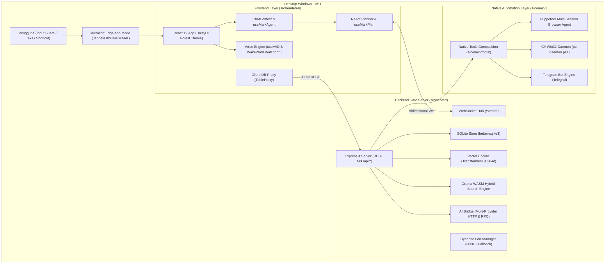

# Gambaran Umum & Konsep Dasar MARK

Dokumen ini menjelaskan latar belakang, filosofi arsitektur, fitur inti, dan tumpukan teknologi (_technology stack_) yang mendasari sistem **MARK (Metacognitive Artificial Relational Knowledge)**.

---

## 1. Visi & Filosofi Produk

MARK diciptakan sebagai asisten otonom tingkat sistem operasi (_Autonomous AI OS Companion_) yang beroperasi langsung di komputer pengguna. Berbeda dengan chatbot AI berbasis web tradisional yang pasif, MARK dirancang dengan tiga prinsip utama:

1. **Privacy-First & Local Sovereignty**: Data pengguna (percakapan, memori jangka panjang, dokumen yang diindeks, status tugas) disimpan secara lokal di mesin pengguna menggunakan SQLite. MARK dapat beroperasi 100% secara offline menggunakan model lokal (LM Studio / Ollama) tanpa membocorkan data ke cloud.
2. **Deep System Agency**: MARK bukan sekadar antarmuka teks; MARK memiliki kendali penuh untuk membaca layar desktop, mengontrol keyboard dan mouse via Windows Win32 API, menjalankan skrip shell, mengelola file di disk, serta menjelajahi internet menggunakan Chromium headless atau browser nyata.
3. **Continuous Cognitive Growth**: MARK memiliki memori kognitif berjangka panjang, pemahaman relasional 4 dimensi (_warmth_, _sarcasm_, _trust_, _energy_) yang berevolusi berdasarkan percakapan pengguna, dan awareness engine yang mengamati aplikasi apa yang sedang aktif di layar Windows.

---

## 2. Perbandingan Arsitektur: MARK vs Agen AI Lain

| Aspek                    | Chatbot Tradisional (ChatGPT / Claude Web) | Framework Agen Cloud (LangChain / CrewAI) | MARK                                |
| :----------------------- | :----------------------------------------- | :---------------------------------------- | :---------------------------------- |
| **Lingkungan Eksekusi**  | Server Cloud Tertutup                      | Container / Python Server                 | Mesin Pengguna (Windows Desktop)    |
| **Akses Sistem Operasi** | Tidak Ada                                  | Terbatas pada Sandbox Docker              | Langsung ke Win32 API & Shell Lokal |
| **Otomasi Browser**      | Serverless / Cloud Browser                 | Playwright Server                         | Multi-Session Puppeteer Terisolasi  |
| **Penyimpanan Data**     | Basis Data Penyedia Cloud                  | Basis Data Eksternal / Vector DB SaaS     | SQLite Terpusat Lokal + Orama WASM  |
| **Kontrol Keamanan**     | Hardcoded di Server                        | Bergantung Pengembang                     | 4-Tier Approval & Auto Mode (YOLO)  |
| **Interaksi Suara**      | WebRTC Cloud                               | Cloud API (Whisper / ElevenLabs)          | Web Speech API Lokal + Edge-TTS     |

---

## 3. Diagram Arsitektur Tingkat Tinggi

MARK mengadopsi arsitektur **Decoupled Backend-Frontend**:

- **Backend**: Node.js ESM server murni yang menangani IO berat, database SQLite, eksekusi tool native, dan koneksi AI.
- **Frontend**: Single Page Application (React 19 / Vite 7 / Tailwind CSS 4) yang dimuat di dalam jendela Microsoft Edge App Mode (`--app=http://localhost:<port>`).

---

## 4. Tumpukan Teknologi Utama

### Backend Core Server

- **Runtime**: [Node.js 20+ (ESM)](https://nodejs.org/)
- **Web Framework**: [Express 4](https://expressjs.com/)
- **Real-Time Stream**: [ws](https://github.com/websockets/ws) (WebSocket Hub di rute `/stream`)
- **Basis Data Utama**: [better-sqlite3](https://github.com/WiseLibs/better-sqlite3) (SQLite terpusat dengan Write-Ahead Logging di `~/.config/mark-agent/mark.db`)
- **Pencarian Vektor & Full-Text**: [@orama/orama](https://orama.com/) (Pencarian hibrida berbasis WebAssembly)
- **Model Vektor Lokal**: [@huggingface/transformers](https://huggingface.co/docs/transformers.js) (Model embeddings 384 dimensi `Xenova/paraphrase-multilingual-MiniLM-L12-v2` berjalan lokal via WASM)

### Frontend & Antarmuka Pengguna

- **Framework UI**: [React 19](https://react.dev/)
- **Build Tool**: [Vite 7](https://vitejs.dev/)
- **Desain Sistem & Styling**: [Tailwind CSS 4](https://tailwindcss.com/) dengan plugin `@tailwindcss/vite`
- **Komponen UI**: [DaisyUI 5](https://daisyui.com/) (Tema default: `forest`)
- **Editor & Rendering**: Monaco Editor (`@monaco-editor/react`), React Markdown, React Syntax Highlighter (Prism / oneDark)
- **Tipografi**: Font Poppins (Heading) dan Inter (Body) yang di-bundle secara lokal

### Otomasi & Sistem Native

- **Otomasi Browser**: [puppeteer-core](https://pptr.dev/) yang secara otomatis menemukan instalasi Microsoft Edge, Google Chrome, atau Brave di mesin Windows pengguna.
- **Otomasi Desktop**: Skrip PowerShell persisten (`src/main/pc-agent-scripts/pc-daemon.ps1`) yang mengkompilasi kode C# Win32 in-memory untuk simulasi mouse, keyboard Unicode `SendInput`, pembacaan hierarchy UI Automation, dan pelacakan jendela aktif.
- **Transkripsi Suara (STT)**: Native Web Speech API (`webkitSpeechRecognition`) tanpa latensi server untuk passive listening, dengan fallback Groq Whisper API untuk berkas rekaman.
- **Sintesis Suara (TTS)**: [msedge-tts](https://github.com/schroffl/msedge-tts) dengan suara natural bahasa Indonesia `id-ID-ArdiNeural` secara streaming chunk.
- **Komunikasi Jarak Jauh**: [Telegraf](https://telegraf.js.org/) (Framework Bot Telegram resmi untuk kendali jarak jauh dan persetujuan keamanan).

---

## 5. Sumber Daya Terkait

- [Panduan Instalasi & Persiapan Lingkungan](./installation.md)
- [Panduan Quickstart & Penggunaan Pertama](./quickstart.md)
- [Bedah Arsitektur & Desain Sistem](../02-architecture/system-design.md)
