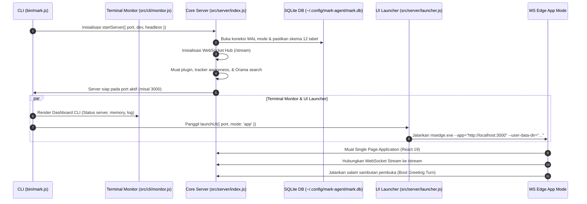

# Panduan Quickstart & Penggunaan Pertama

Dokumen ini menjelaskan cara menjalankan sistem **MARK**, memahami mode eksekusi yang tersedia, parameter perintah CLI, dan alur inisialisasi pada saat pertama kali dijalankan.

---

## 1. Perintah Eksekusi Utama

MARK menyediakan beberapa skrip eksekusi npm di dalam `package.json` yang disesuaikan untuk kebutuhan produksi maupun pengembangan:

| Perintah             | Deskripsi & Perilaku                                                                                                                                             | Target Penggunaan           |
| :------------------- | :--------------------------------------------------------------------------------------------------------------------------------------------------------------- | :-------------------------- |
| `npm start`          | Menjalankan `node bin/mark.js`. Memulai Core Server, Terminal Live Monitor, dan meluncurkan antarmuka Microsoft Edge App Mode.                                   | Penggunaan harian pengguna  |
| `npm run dev`        | Menjalankan server terintegrasi dengan middleware Vite HMR (`--dev`). Perubahan kode di `src/renderer/` langsung ter-update seketika (_Hot Module Replacement_). | Pengembangan aktif          |
| `npm run dev:server` | Menjalankan server backend secara standalone (`node src/server/index.js --dev`) tanpa membuka antarmuka Edge.                                                    | Debugging backend & API     |
| `npm run dev:ui`     | Menjalankan Vite dev server standalone di port `5173`. Mem-proxy request `/api` dan `/stream` ke port `3000`.                                                    | Pengujian UI frontend murni |
| `npm run build:ui`   | Melakukan kompilasi bundle React ke folder `out/renderer`.                                                                                                       | Persiapan rilis produksi    |
| `npm run lint`       | Menjalankan audit linter ESLint dengan cache.                                                                                                                    | Pengecekan kualitas kode    |

---

## 2. Argumen Perintah CLI (`bin/mark.js`)

Saat menjalankan MARK langsung melalui CLI, Anda dapat menambahkan parameter berikut:

```powershell
node bin/mark.js [opsi]
```

### Opsi yang Didukung:

- `--port <nomor>`: Menentukan port awal untuk HTTP server dan WebSocket (default: `3000`). Jika port sedang terpakai, sistem dynamic port manager akan otomatis mencari port berikutnya (`3001`, `3002`, dst.).
- `--headless` / `--no-ui`: Menjalankan Core Server dan Terminal Monitor di latar belakang tanpa membuka jendela Microsoft Edge.
- `--dev`: Mengaktifkan mode pengembang, menggunakan profil browser khusus `ui-profile-dev`, dan mengaktifkan live reload Vite.
- `--browser`: Membuka WebUI menggunakan browser default sistem pengguna, bukan Edge App Mode.

---

## 3. Alur Inisialisasi Sistem (_Boot Sequence_)

Saat `bin/mark.js` dipanggil, urutan booting terjadi sebagai berikut:



---

## 4. Penggunaan Pertama Kali

### 1. Membuka Jendela MARK

Setelah menjalankan `npm start`, jendela Microsoft Edge App Mode akan terbuka otomatis tanpa bilah alamat (_frameless application mode_).

### 2. Memilih Penyedia AI

Saat pertama kali membuka MARK, masuk ke menu **Configuration Studio** (ikon gir di sidebar kiri):

- Jika memiliki akun Gemini: Pilih **Gemini Web** (model: `gemini-3.6-flash`).
- Jika memiliki Groq API Key: Pilih **Groq** dan tempel kunci API Anda.
- Jika menggunakan AI Lokal: Buka [LM Studio](https://lmstudio.ai/), muat model GGUF (misal Qwen 2.5 7B atau Llama 3.1 8B), nyalakan local server di port `1234`, lalu pilih **Local LLM** di MARK.

### 3. Berinteraksi via Teks & Suara

- **Teks**: Ketik perintah pada bilah input di bagian bawah (contoh: _"Buatkan rangkuman artikel di link https://example.com"_ atau _"Cari file tugas saya di folder Downloads"_).
- **Suara**: Panggil _"Mark"_ atau _"Hey Mark"_, tunggu bunyi chime nada lembut konfirmasi, lalu ucapkan instruksi Anda.
- **Auto Mode (YOLO Mode)**: Klik tombol ikon petir di sebelah bilah input jika ingin mengizinkan MARK mengeksekusi perintah shell dan modifikasi file tanpa memunculkan pop-up persetujuan berulang.

---

## 5. Sumber Daya Terkait

- [Desain Arsitektur Sistem & Jaringan](../02-architecture/system-design.md)
- [Basis Data SQLite & Penyimpanan Terpusat](../02-architecture/state-and-database.md)
- [Mesin ReAct Planning & Sub-Agents](../03-agent-engine/react-loop.md)
