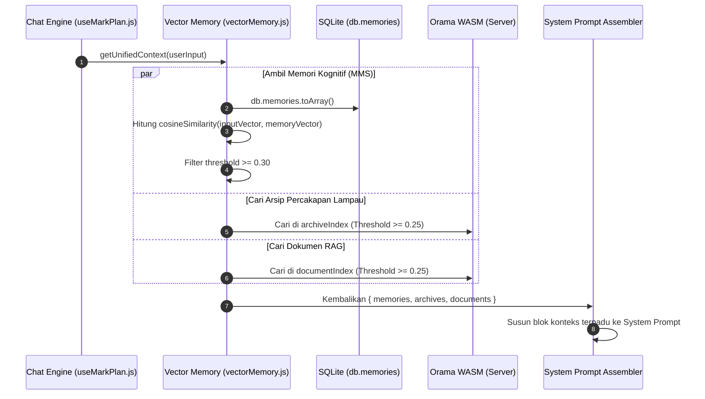
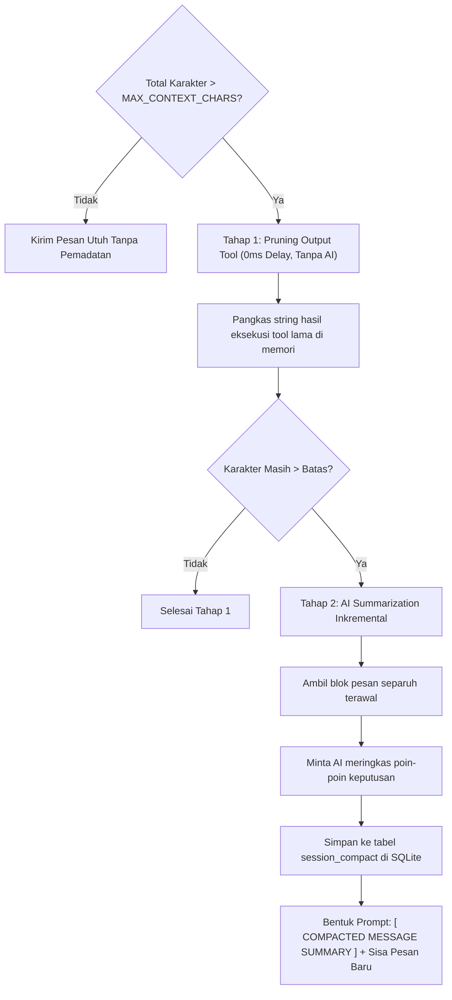

# Mesin Pencarian Vektor & Manajemen Konteks

Dokumen ini menjelaskan subsistem pencarian cerdas pada **MARK**, mencakup pembuatan embeddings vektor lokal 384-dimensi via `@huggingface/transformers`, mesin pencarian hibrida Orama WASM, dan sistem pemadatan memori sesi (_Context Management Engine_).

---

## 1. Local Embedding Engine (`vector-engine.js`)

MARK menghasilkan representasi semantik (_vector embeddings_) secara 100% lokal di mesin pengguna tanpa bergantung pada API embedding eksternal berbayar (seperti OpenAI `text-embedding-ada-002`).

### Karakteristik Model:

- **Pustaka**: [`@huggingface/transformers`](https://huggingface.co/docs/transformers.js) (Transformers.js v3)
- **Model**: `Xenova/paraphrase-multilingual-MiniLM-L12-v2`
- **Dimensi Vektor**: 384 dimensi float
- **Dukungan Bahasa**: Multilingual (termasuk Bahasa Indonesia dan Bahasa Inggris)
- **Runtime**: ONNX Runtime via WebAssembly (WASM) dengan model terkuantisasi (_quantized_ q8)
- **Lokasi Cache Model**: `~/.cache/mark-transformers/` (diunduh otomatis sekali pada pemanggilan pertama, selanjutnya 100% offline).

### Pola Inisialisasi Singleton & Queue:

Pada [`src/server/memory/vector-engine.js`](file:///d:/My%20Project/mark-project/mark/src/server/memory/vector-engine.js), pipeline diinisialisasi secara thread-safe menggunakan antrean _initWaiters_ untuk mencegah pemanggilan ganda (_race condition_) saat sistem booting:

```javascript
let extractor = null
let isInitializing = false
const initWaiters = []

export async function getExtractor() {
  if (extractor) return extractor
  if (isInitializing) {
    return new Promise((resolve) => initWaiters.push(resolve))
  }
  isInitializing = true
  try {
    extractor = await pipeline(
      'feature-extraction',
      'Xenova/paraphrase-multilingual-MiniLM-L12-v2',
      { quantized: true }
    )
    isInitializing = false
    initWaiters.forEach((resolve) => resolve(extractor))
    initWaiters.length = 0
    return extractor
  } catch (err) {
    isInitializing = false
    initWaiters.forEach((resolve) => resolve(null))
    initWaiters.length = 0
    return null
  }
}
```

---

## 2. Pencarian Hibrida Orama WASM (`orama-store.js`)

Untuk mengindeks dan mencari riwayat percakapan serta berkas dokumen pengguna, MARK menggunakan engine database vektor berbasis in-memory WebAssembly: [`@orama/orama`](https://orama.com/).

### Dua Indeks Utama:

1. **`archiveIndex`**: Menyimpan dan mengindeks seluruh giliran percakapan yang diarsipkan (`chat_archives`).
2. **`documentIndex`**: Menyimpan potongan berkas dokumen pengguna untuk Retrieval-Augmented Generation (RAG).

### Algoritma Pencarian Vektor + BM25:

Orama menggabungkan pencarian teks tradisional (BM25 full-text keyword matching) dengan pencarian kemiripan kosinus vektor (_cosine vector similarity_). Hal ini menjamin kata kunci spesifik (seperti nama variabel kode atau nomor telepon) tetap dapat ditemukan, sekaligus memahami konteks sinonim pertanyaan pengguna.

### Ambang Batas Kemiripan (_Similarity Thresholds_):

- **Orama Search Threshold**: **0.25** (diatur di `src/server/memory/orama-store.js`).
- **Client Vector Memory Threshold**: **0.30** (diatur di `src/renderer/src/api/vectorMemory.js` untuk membuang memori kognitif yang tidak relevan).

---

## 3. Alur Pengambilan Konteks Terpadu (_Unified Context_)

Sebelum perintah pengguna diteruskan ke model LLM, sistem mengumpulkan seluruh konteks relevan secara paralel melalui fungsi `getUnifiedContext()`:



---

## 4. Context Management Engine (`contextManager.js`)

Pada sesi percakapan yang panjang atau saat agent menjalankan banyak tool yang menghasilkan ribuan baris teks, ukuran konteks dapat melebihi batas jendela konteks model LLM. MARK menerapkan **Context Manager Engine** di [`src/renderer/src/api/ai/contextManager.js`](file:///d:/My%20Project/mark-project/mark/src/renderer/src/api/ai/contextManager.js).

### Parameter & Batas Karakter:

- `MAX_CONTEXT_CHARS = 525000`: Batas global (~131.000 token ekuivalen untuk model berkapasitas 128k/200k konteks).

### Normalisasi Konten Multimodal (Pencegahan Token Blowout):

Gambar Base64 berukuran ratusan ribu karakter seringkali membakar habis jendela konteks. MARK menerapkan normalisasi bobot pada `calculateMessageChars`:

- Teks: Dihitung panjang karakter asli (`text.length`).
- Gambar Base64: Dinormalisasi menjadi bobot tetap **2.000 karakter ekuivalen** (setara ~250–500 token LLM vision riil), mengabaikan ukuran string Base64 mentah.

### 2 Tahapan Pemadatan Konteks (_Compaction Pipeline_):



### 1. Tahap 1: In-Memory Tool Output Pruning (Nol Biaya Token)

Memotong keluaran (_stdout/result_) dari eksekusi tool yang telah lewat lebih dari 3 giliran menjadi potongan ringkas (maksimal 300 karakter), karena AI biasanya sudah menyerap informasi tersebut pada giliran sebelumnya.

### 2. Tahap 2: Inkremental AI Summarization

Jika pemangkasan tool belum mencukupi:

- Pesan-pesan lama di-slice dan dirangkum oleh model AI berbiaya rendah menjadi blok ringkasan terstruktur: `[ COMPACTED MESSAGE SUMMARY ]`.
- Ringkasan disimpan di tabel `session_compact` SQLite dengan penanda `last_compacted_message_id`.
- Pesan yang sudah terangkum tidak lagi dikirim secara mentah ke LLM, menghemat 70–85% ruang konteks.

### Ring Gauge Context Indicator di UI:

Persentase kapasitas konteks aktif dipantau secara visual di samping tombol input [`InputBar.jsx`](file:///d:/My%20Project/mark-project/mark/src/renderer/src/components/core/InputBar.jsx) melalui komponen cincin indikator (_Ring Gauge_):

- Hijau: Kapasitas < 75%
- Kuning/Amber: Kapasitas 75% - 89%
- Merah: Kapasitas >= 90% (pemadatan otomatis aktif)

---

## 5. Sumber Daya Terkait

- [Arsitektur Basis Data SQLite Terpusat](./state-and-database.md)
- [Pusat Orkestrasi ReAct Loop & Intent Routing](../03-agent-engine/react-loop.md)
- [Sistem Sub-Agent Mandiri Mission Control](../03-agent-engine/multi-agent-subagents.md)
