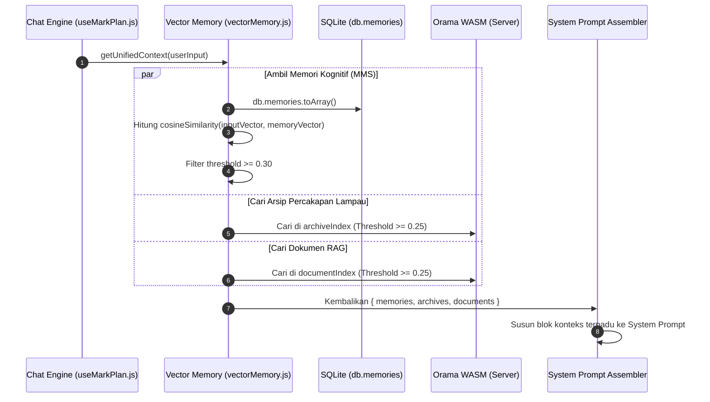
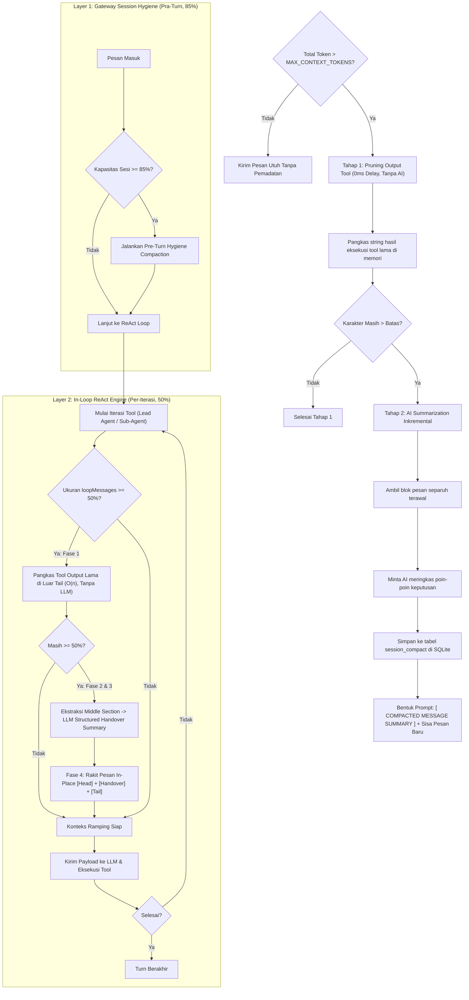

# Mesin Pencarian Vektor & Manajemen Konteks

Dokumen ini menjelaskan subsistem pencarian cerdas pada **MARK**, mencakup pembuatan embeddings vektor lokal 384-dimensi via `@huggingface/transformers`, mesin pencarian hibrida Orama WASM, dan sistem pemadatan memori sesi (_Context Management Engine_).

---

## 1. Local Embedding Engine (`vector-engine.js`)

MARK menghasilkan representasi semantik (_vector embeddings_) secara 100% lokal di mesin pengguna tanpa bergantung pada API embedding eksternal berbayar (seperti OpenAI `text-embedding-ada-002`).

### Karakteristik Model:

- **Pustaka**: [`@huggingface/transformers`](https://huggingface.co/docs/transformers.js) (Transformers.js v3)
- **Model**: `Xenova/paraphrase-multilingual-MiniLM-L12-v2`
- **Dimensi Vektor**: 384 dimensi float
- **Dukungan Bahasa**: Multilingual (termasuk Bahasa Indonesia dan Bahasa Inggris)
- **Runtime**: ONNX Runtime via WebAssembly (WASM) dengan model terkuantisasi (_quantized_ q8)
- **Lokasi Cache Model**: `~/.cache/mark-transformers/` (diunduh otomatis sekali pada pemanggilan pertama, selanjutnya 100% offline).

### Pola Inisialisasi Singleton & Queue:

Pada [`src/server/memory/vector-engine.js`](file:///d:/My%20Project/mark-project/mark/src/server/memory/vector-engine.js), pipeline diinisialisasi secara thread-safe menggunakan antrean _initWaiters_ untuk mencegah pemanggilan ganda (_race condition_) saat sistem booting:

```javascript
let extractor = null
let isInitializing = false
const initWaiters = []

export async function getExtractor() {
  if (extractor) return extractor
  if (isInitializing) {
    return new Promise((resolve) => initWaiters.push(resolve))
  }
  isInitializing = true
  try {
    extractor = await pipeline(
      'feature-extraction',
      'Xenova/paraphrase-multilingual-MiniLM-L12-v2',
      { quantized: true }
    )
    isInitializing = false
    initWaiters.forEach((resolve) => resolve(extractor))
    initWaiters.length = 0
    return extractor
  } catch (err) {
    isInitializing = false
    initWaiters.forEach((resolve) => resolve(null))
    initWaiters.length = 0
    return null
  }
}
```

---

## 2. Pencarian Hibrida Orama WASM (`orama-store.js`)

Untuk mengindeks dan mencari riwayat percakapan serta berkas dokumen pengguna, MARK menggunakan engine database vektor berbasis in-memory WebAssembly: [`@orama/orama`](https://orama.com/).

### Dua Indeks Utama:

1. **`archiveIndex`**: Menyimpan dan mengindeks seluruh giliran percakapan yang diarsipkan (`chat_archives`).
2. **`documentIndex`**: Menyimpan potongan berkas dokumen pengguna untuk Retrieval-Augmented Generation (RAG).

### Algoritma Pencarian Vektor + BM25:

Orama menggabungkan pencarian teks tradisional (BM25 full-text keyword matching) dengan pencarian kemiripan kosinus vektor (_cosine vector similarity_). Hal ini menjamin kata kunci spesifik (seperti nama variabel kode atau nomor telepon) tetap dapat ditemukan, sekaligus memahami konteks sinonim pertanyaan pengguna.

### Ambang Batas Kemiripan (_Similarity Thresholds_):

- **Orama Search Threshold**: **0.25** (diatur di `src/server/memory/orama-store.js`).
- **Client Vector Memory Threshold**: **0.30** (diatur di `src/renderer/src/api/vectorMemory.js` untuk membuang memori kognitif yang tidak relevan).

---

## 3. Alur Pengambilan Konteks Terpadu (_Unified Context_)

Sebelum perintah pengguna diteruskan ke model LLM, sistem mengumpulkan seluruh konteks relevan secara paralel melalui fungsi `getUnifiedContext()`:



---

## 4. Context Management Engine (`contextManager.js`)

Pada sesi percakapan yang panjang atau saat agent menjalankan banyak tool yang menghasilkan ribuan baris teks, ukuran konteks dapat melebihi batas jendela konteks model LLM. MARK menerapkan **Context Manager Engine** presisi berbasis token di [`src/renderer/src/api/ai/contextManager.js`](file:///d:/My%20Project/mark-project/mark/src/renderer/src/api/ai/contextManager.js).

### Parameter & Batas Token (256K Tokens):

- `MAX_CONTEXT_TOKENS = 256000`: Batas global 256K tokens (menggunakan tokenizer BPE lokal via `gpt-tokenizer` serta adopsi langsung objek `usage` dari server API).
- `GATEWAY_HYGIENE_THRESHOLD = 0.85`: Jaring pengaman pra-turn pada 85% kapasitas (~217.6K tokens) untuk menangkap backlog percakapan besar sebelum pesan diproses.
- `IN_LOOP_COMPACT_THRESHOLD = 0.50`: Ambang pemicu kompresor in-loop ReAct pada 50% kapasitas (~128K tokens) di setiap langkah eksekusi tool.
- `OLD_TOOL_PRUNE_CHAR_LIMIT = 200`: Ambang batas karakter output tool lama yang langsung dipangkas secara $O(n)$.
- `CLEARED_TOOL_PLACEHOLDER = '[Old tool output cleared to save context space]'`: Penanda stub pemangkasan hasil tool lama.

### Skema Hibrida & Zero-Recalculation DB Caching:

1. **Adopsi Usage Server Resmi**: Jika provider menyediakan metadata `usage` (`prompt_tokens`, `completion_tokens`, `total_tokens` dari OpenAI, Groq, LM Studio, Cerebras), MARK langsung mengadopsi angka resmi tersebut tanpa perhitungan ulang tokenizer.
2. **Baseline O(1) Sesi**: Fungsi `calculateSessionTokens` mengambil nilai `usage.total_tokens` asisten terakhir sebagai baseline riwayat dan hanya menghitung delta token pesan baru setelahnya.
3. **Persistensi SQLite**: Objek `usage` dan nilai `tokens` per-pesan disimpan langsung ke tabel `sessions` dan `session_compact` di SQLite (`mark.db`), sehingga riwayat masa lalu tidak pernah ditokenisasi ulang saat aplikasi dibuka kembali.
4. **Fallback Presisi `gpt-tokenizer`**: Untuk provider berbasis Web RPC tanpa metadata usage (DeepSeek Web & Gemini Web) serta estimasi real-time input bar, MARK menjalankan BPE tokenizer lokal murni JavaScript tanpa dependensi WASM/eksternal.
5. **System Prompt & Multimodal Image**: System prompt ikut dihitung secara presisi ke dalam kapasitas token, dan gambar Base64 dinormalisasi menjadi estimasi tetap **~1.000 tokens** per gambar (mencegah ledakan ratusan ribu karakter Base64).

### Sistem Kompresi Ganda (Dual-Layer Architecture):

Mengadopsi pola arsitektur dari **Hermes Agent (Nous Research)**, MARK menerapkan dua lapisan kompresor independen:

1. **Layer 1: Gateway Session Hygiene (Pra-Turn - 85% Ambang Batas / ~217.6K Tokens)**:
   Berjalan di `useMarkPlan.js` sebelum pesan diproses oleh agen. Ini adalah jaring pengaman untuk mencegah kegagalan API ketika sesi menjadi terlalu besar di antara giliran (misalnya akumulasi percakapan ribuan pesan).
2. **Layer 2: In-Loop Agent Context Engine (Setiap Iterasi - 50% Ambang Batas / ~128K Tokens)**:
   Berjalan di dalam perulangan ReAct `while (!isDone)` pada Lead Agent (`useMarkPlan.js`) dan `while (!abortController.signal.aborted)` pada Sub-Agent (`subagentExecutor.js`). Memastikan agen dapat menjalankan 50–500 iterasi tool tanpa mengalami pembengkakan konteks (_context ballooning_).



### 1. Tahap 1: In-Memory Tool Output Pruning (Nol Biaya Token)

### Algoritma Kompresi 4-Fase Hermes:

Memotong keluaran (_stdout/result_) dari eksekusi tool yang telah lewat lebih dari 3 giliran menjadi potongan ringkas (maksimal 300 karakter), karena AI biasanya sudah menyerap informasi tersebut pada giliran sebelumnya.

1. **Fase 1: Prune Old Tool Results (Murah, O(n), Tanpa Panggilan LLM)**
   Output dari pemanggilan tool lama (> 200 karakter) yang berada di luar zona ekor aktif (_tail_) diganti dengan stub:
   `[Old tool output cleared to save context space]`
   Operasi ini menghemat 70–80% memori seketika tanpa menggunakan biaya token LLM sama sekali.
2. **Fase 2: Penyelarasan Batas Mundur (Boundary Backward Alignment)**
   Fungsi `alignBoundaryBackward` memastikan bahwa pasangan `tool_calls` pada asisten dan `tool_result` pada role tool tidak pernah terputus atau terpisah di antara batas potongan ringkasan dan ekor aktif.
3. **Fase 3: Dokumen Serah-Terima Teknis (Structured Handover Document)**
   Bagian tengah yang dipadatkan dirangkum menggunakan template serah-terima teknis terstruktur:
   - `## Goal` (Tujuan spesifik pengguna)
   - `## Constraints & Preferences` (Aturan & preferensi teknis)
   - `## Progress` (`### Done`, `### In Progress`, `### Blocked`)
   - `## Key Decisions` (Keputusan teknis kunci dan alasannya)
   - `## Relevant Files` (Daftar berkas yang dibaca/diedit/dibuat dengan catatan fungsi)
   - `## Next Steps` (Langkah konkret berikutnya)
   - `## Critical Context` (Nilai port, variabel, error mentah, konfigurasi)
     _Iterative Re-compression_: Jika ringkasan sebelumnya sudah ada, model memperbarui ringkasan lama daripada memulai dari awal.
4. **Fase 4: Perakitan In-Place & Sanitasi Pasangan Tool Yatim**
   Pesan dirakit kembali pada **ID sesi stabil yang sama (`in_place: true`)** tanpa memecah atau merotasi ID sesi. Fungsi `cleanOrphanToolPairs` membuang tool result yang kehilangan induk asistennya untuk mencegah penolakan API (HTTP 400).

### 2. Tahap 2: Inkremental AI Summarization

Jika pemangkasan tool belum mencukupi:

- Pesan-pesan lama di-slice dan dirangkum oleh model AI berbiaya rendah menjadi blok ringkasan terstruktur: `[ COMPACTED MESSAGE SUMMARY ]`.
- Ringkasan disimpan di tabel `session_compact` SQLite dengan penanda `last_compacted_message_id`.
- Pesan yang sudah terangkum tidak lagi dikirim secara mentah ke LLM, menghemat 70–85% ruang konteks.

### Ring Gauge Context Indicator di UI:

Persentase kapasitas konteks aktif dipantau secara visual di samping tombol input [`InputBar.jsx`](file:///d:/My%20Project/mark-project/mark/src/renderer/src/components/core/InputBar.jsx) melalui komponen cincin indikator (_Ring Gauge_):

- Hijau: Kapasitas < 75%
- Kuning/Amber: Kapasitas 75% - 89%
- Merah: Kapasitas >= 90% (pemadatan otomatis aktif)
- Hijau: Kapasitas < 50% (Beban Optimal)
- Kuning/Amber: Kapasitas 50% - 84% (In-Loop Compressor Aktif)
- Merah/Rose: Kapasitas >= 85% (Gateway Session Hygiene Aktif)

---

## 5. Sumber Daya Terkait

- [Arsitektur Basis Data SQLite Terpusat](./state-and-database.md)
- [Pusat Orkestrasi ReAct Loop & Intent Routing](../03-agent-engine/react-loop.md)
- [Sistem Sub-Agent Mandiri Mission Control](../03-agent-engine/multi-agent-subagents.md)
