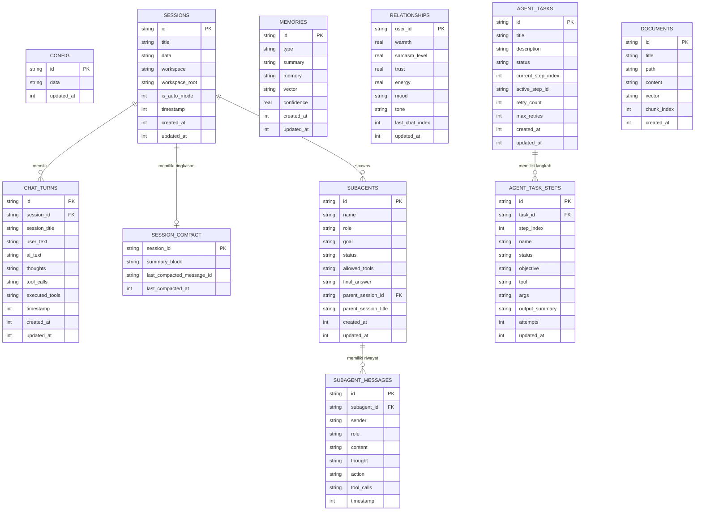

# Arsitektur Basis Data SQLite & Tabel Relasional

Dokumen ini membedah arsitektur penyimpanan data terpusat di sistem **MARK**, merinci 12 tabel relasional SQLite, optimasi performa _Write-Ahead Logging_ (WAL), mekanisme auto-migrasi skema, dan implementasi transparent proxy `TableProxy` pada frontend.

---

## 1. Filosofi & Penyimpanan Terpusat

MARK memigrasikan seluruh penyimpanan basis data dari IndexedDB/Dexie peramban lokal ke sebuah engine basis data **SQLite** berkas tunggal yang dikelola oleh library performa tinggi [`better-sqlite3`](https://github.com/WiseLibs/better-sqlite3).

### Lokasi Berkas:

`C:\Users\<Username>\.config\mark-agent\mark.db`

### Konfigurasi Performa Pragmas:

Pada inisialisasi di [`src/server/memory/db-store.js`](file:///d:/My%20Project/mark-project/mark/src/server/memory/db-store.js), SQLite dikonfigurasi untuk kecepatan baca/tulis konkruen maksimal:

```sql
PRAGMA journal_mode = WAL;        -- Write-Ahead Logging: Operasi baca tidak memblokir operasi tulis
PRAGMA synchronous = NORMAL;       -- Pengurangan fsync overhead tanpa risiko korupsi pada WAL
PRAGMA temp_store = MEMORY;        -- Tabel sementara dan indeks disimpan di RAM
```

---

## 2. Diagram Relasi Entitas (ER Diagram)



---

## 3. Rincian 12 Tabel Relasional

| Nama Tabel          | Tujuan & Kegunaan                                                                                                      | Kolom Kunci & Tipe Data                                                                                             |
| :------------------ | :--------------------------------------------------------------------------------------------------------------------- | :------------------------------------------------------------------------------------------------------------------ |
| `config`            | Menyimpan preferensi aplikasi, kunci API, provider AI aktif, rate TTS, dan custom wake words.                          | `id` (PK, TEXT), `data` (JSON TEXT), `updated_at` (INTEGER)                                                         |
| `sessions`          | Mengelola thread percakapan chat, binding direktori workspace proyek, dan status Auto Mode (YOLO).                     | `id` (PK, TEXT), `title` (TEXT), `workspace_root` (TEXT), `is_auto_mode` (INTEGER 0/1), `timestamp` (INTEGER)       |
| `chat_turns`        | Riwayat giliran pesan per sesi, mencatat pemikiran (_thoughts_), riwayat tool yang dieksekusi, dan respon asisten.     | `id` (PK, TEXT), `session_id` (TEXT), `user_text` (TEXT), `ai_text` (TEXT), `executed_tools` (JSON TEXT)            |
| `session_compact`   | Cache memori ringkasan hasil pemadatan konteks percakapan untuk mencegah lonjakan token pada sesi panjang.             | `session_id` (PK, TEXT), `summary_block` (TEXT), `last_compacted_message_id` (TEXT), `last_compacted_at` (INTEGER)  |
| `memories`          | Sistem Memori Kognitif Jangka Panjang (MMS) dengan klasifikasi kategori (`profile`, `preference`, `notes`, `learn`).   | `id` (PK, TEXT), `type` (TEXT), `summary` (TEXT), `memory` (TEXT), `vector` (JSON 384d Array), `confidence` (REAL)  |
| `relationships`     | Model relasional dinamik 4D yang mengukur ikatan emosional dan gaya komunikasi antara MARK dan pengguna.               | `user_id` (PK, TEXT), `warmth` (REAL), `sarcasm_level` (REAL), `trust` (REAL), `energy` (REAL), `mood` (TEXT)       |
| `subagents`         | Registry status agen pembantu mandiri (_Mission Control_), status eksekusi, target tugas, dan batasan alat.            | `id` (PK, TEXT), `name` (TEXT), `role` (TEXT), `goal` (TEXT), `status` (TEXT), `parent_session_id` (TEXT)           |
| `subagent_messages` | Aliran pesan ReAct internal sub-agent, mencatat pemikiran terisolasi, pemanggilan alat, dan observasi.                 | `id` (PK, TEXT), `subagent_id` (TEXT), `sender` (TEXT), `thought` (TEXT), `action` (TEXT), `tool_calls` (JSON TEXT) |
| `agent_tasks`       | Definisi Durable Agent Tasks untuk pekerjaan multi-langkah berdurasi panjang dengan persistensi state.                 | `id` (PK, TEXT), `title` (TEXT), `status` (pending/running/completed/failed), `current_step_index` (INTEGER)        |
| `agent_task_steps`  | Rincian instruksi langkah tugas individual, kriteria penerimaan, hash konten berkas, dan batas coba ulang (_retries_). | `id` (PK, TEXT), `task_id` (TEXT), `step_index` (INTEGER), `objective` (TEXT), `attempts` (INTEGER)                 |
| `documents`         | Indeks berkas dokumen lokal pengguna untuk Retrieval-Augmented Generation (RAG).                                       | `id` (PK, TEXT), `title` (TEXT), `content` (TEXT), `vector` (JSON 384d Array), `chunk_index` (INTEGER)              |
| `learned_skills`    | Kumpulan instruksi atau skrip keahlian baru yang dipelajari MARK secara mandiri dari instruksi pengguna.               | `id` (PK, TEXT), `name` (TEXT), `description` (TEXT), `script` (TEXT), `category` (TEXT)                            |

---

## 4. Mekanisme Auto-Migrasi Skema (`ensureTableColumns`)

Untuk mencegah galat (_schema drift_) saat pengguna memperbarui versi MARK tanpa harus menghapus database lama, backend menerapkan fungsi auto-migrasi otomatis di [`db-store.js`](file:///d:/My%20Project/mark-project/mark/src/server/memory/db-store.js):

```javascript
function ensureTableColumns(tableName, requiredColumns) {
  try {
    const existingCols = sqlite
      .prepare(`PRAGMA table_info(${tableName})`)
      .all()
      .map((c) => c.name)
    for (const [colName, colType] of Object.entries(requiredColumns)) {
      if (!existingCols.includes(colName)) {
        sqlite.exec(`ALTER TABLE ${tableName} ADD COLUMN ${colName} ${colType}`)
      }
    }
  } catch (err) {
    console.warn(`[DB Store] Auto-migration error on ${tableName}:`, err.message)
  }
}
```

Mekanisme ini memastikan kolom baru (seperti `is_auto_mode` pada tabel `sessions` atau `summary_block` pada `session_compact`) langsung ditambahkan ke tabel yang sudah ada secara transparan saat server booting.

---

## 5. Client-Side Transparent Proxy (`TableProxy`)

Agar komponen UI frontend (React) dapat memanggil operasi basis data menggunakan sintaks query yang familier (menyerupai antarmuka Dexie/ORM) tanpa mengimpor pustaka Node native, dibuatlah lapisan proxy di [`src/renderer/src/api/db.js`](file:///d:/My%20Project/mark-project/mark/src/renderer/src/api/db.js):

```javascript
// Contoh pemanggilan di komponen React
const sessions = await db.sessions.toArray()
const activeSession = await db.sessions.get(sessionId)
await db.sessions.put({ id: sessionId, is_auto_mode: 1 })
await db.memories.where('type').equals('preference').toArray()
```

### Arsitektur `TableProxy` & `CollectionProxy`:

1. `TableProxy(endpoint, idField)`: Memetakan metode `toArray()`, `get(id)`, `add(item)`, `put(item)`, dan `delete(id)` menjadi permintaan HTTP `fetch` (`GET`, `POST`, `DELETE`) ke backend REST route di `/api/*`.
2. `CollectionProxy`: Mengizinkan operasi penyaringan (_chaining queries_) seperti `.where(field).equals(val)`, `.sortBy(field)`, `.reverse()`, `.limit(count)`, dan `.first()`.

---

## 6. Cadangan & Pemulihan Basis Data (Backup & Restore)

MARK menyertakan utilitas ekspor dan impor basis data penuh:

- **`exportFullDatabase()`**: Mengemas seluruh isi 12 tabel ke dalam format JSON terenkapsulasi.
- **`restoreFullDatabase(dumpData)`**: Memulihkan database dari file cadangan JSON. Fitur ini memiliki kompabilitas mundur (_backward compatibility_) penuh terhadap struktur dump lama Dexie JSON v4 dengan normalisasi kolom otomatis (misal: memetakan `pairId` ke `id` dan membersihkan alias float `1.0` menjadi integer string `'1'`).

---

## 7. Sumber Daya Terkait

- [Mesin Pencarian Vektor & Context Manager](./search-and-memory.md)
- [Desain Sistem & Komunikasi IPC](./system-design.md)
- [Pusat Orkestrasi ReAct Loop](../03-agent-engine/react-loop.md)
