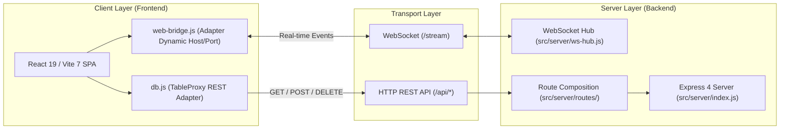
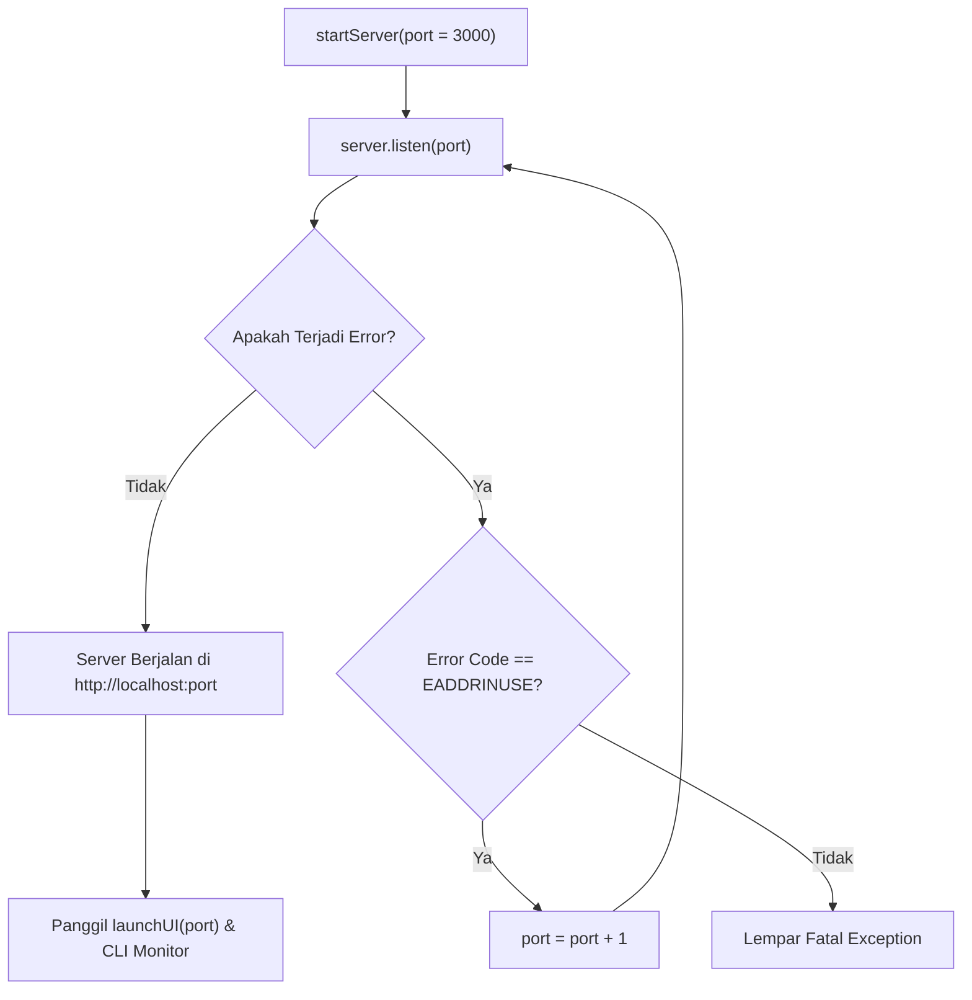

# Desain Sistem & Komunikasi IPC

Dokumen ini membedah arsitektur internal sistem **MARK**, menjelaskan pola pemisahan backend server dan client renderer (_Decoupled Architecture_), manajemen port dinamis, protokol WebSocket real-time, dan lifecycle launcher Microsoft Edge.

---

## 1. Filosofi Desain: Node Core + Web Client

MARK meninggalkan pendekatan monolitik Electron tradisional dan beralih ke arsitektur **Node.js Core Server + Web Browser/App Mode Client**:



### Keunggulan Desain Ini:

1. **Pemisahan Tanggung Jawab Total**: Kode antarmuka di `src/renderer/` tidak memiliki dependensi langsung pada modul native Node.js (`fs`, `path`, `child_process`). Hal ini mencegah _memory leak_ renderer dan memudahkan portabilitas antarmuka ke browser standar.
2. **Kinerja & Stabilitas Terisolasi**: Jika terjadi kegagalan atau crash pada tampilan antarmuka, proses backend server (termasuk SQLite, task daemon, dan sub-agents yang sedang berjalan) tetap beroperasi tanpa henti.
3. **Efisiensi Memori**: Menghindari beban ganda runtime Chromium dan Node.js yang biasanya terjadi pada framework desktop terpadu.

---

## 2. Dynamic Port Manager & Penanganan `EADDRINUSE`

Ketika MARK dinyalakan, server mencoba mendengarkan (_listen_) pada port default `3000`. Jika port tersebut telah dipakai oleh proses lain di komputer pengguna, server tidak akan crash, melainkan otomatis beralih ke port berikutnya secara rekursif:



Implementasi di [`src/server/index.js`](file:///d:/My%20Project/mark-project/mark/src/server/index.js) memastikan pengguna tidak perlu repot mematikan aplikasi lain yang kebetulan menggunakan port `3000`.

---

## 3. Komposisi Route REST API

Seluruh rute HTTP didaftarkan melalui satu pintu masuk terpusat di [`src/server/routes/index.js`](file:///d:/My%20Project/mark-project/mark/src/server/routes/index.js). Setiap domain fitur memiliki berkas rute tersendiri:

```text
src/server/routes/
├── index.js                     # Komposisi utama: app.use('/api', ...)
├── config.routes.js             # Konfigurasi aplikasi (/api/config)
├── chat.routes.js               # Pengiriman pesan & unggah berkas temp (/api/chat/*)
├── memory.routes.js             # CRUD SQLite 12 tabel (/api/sessions, /api/memories, dll.)
├── subagents.routes.js          # Manajemen sub-agent (/api/subagents/*)
├── skills.routes.js             # Pemasangan & registrasi skill (/api/skills/*)
├── plugins.routes.js            # Eksekusi & pemuatan plugin (/api/plugins/*)
├── awareness.routes.js          # Buffer aktivitas jendela OS (/api/awareness/*)
├── tasks.routes.js              # Durable Agent Tasks & Task Daemon (/api/tasks/*)
├── integrations.routes.js       # Status integrasi Telegram & Google (/api/integrations/*)
└── ai.routes.js                 # Testing koneksi AI & status provider (/api/ai/*)
```

> [!IMPORTANT]
> **Keamanan Endpoint Berprivilese Tinggi**:
> Endpoint seperti `/api/tools/execute`, `/api/db/restore`, `/api/plugins/execute`, `/api/skills/install`, dan `/api/tasks/daemon/*` memiliki akses langsung ke mesin host Windows dan dilindungi oleh pengecekan format payload ketat.

---

## 4. WebSocket Hub (`ws-hub.js`)

Untuk komunikasi bidirectional latensi rendah antara frontend dan backend, MARK menggunakan WebSocket server di rute `/stream`.

### Struktur Protokol WebSocket:

Setiap paket pesan yang dikirimkan melalui WebSocket memiliki struktur format JSON standar:

```json
{
  "type": "nama:event",
  "data": { ... }
}
```

### Daftar Event Kunci:

| Nama Event         | Arah             | Fungsi & Muatan Data                                                                          |
| :----------------- | :--------------- | :-------------------------------------------------------------------------------------------- |
| `ai:status`        | Server -> Client | Notifikasi pemikiran / progress AI saat ReAct loop berjalan (`data: "Menganalisis file..."`). |
| `ai:abort`         | Client -> Server | Mengirim sinyal pembatalan seketika ke seluruh fetch AI dan sub-agents.                       |
| `browser:preview`  | Server -> Client | Siaran streaming gambar frame/layar Chromium Puppeteer format Base64 JPEG per sesi.           |
| `subagent:report`  | Server -> Client | Pengiriman laporan hasil kerja sub-agent yang selesai di latar belakang ke sesi aktif.        |
| `db:restored`      | Server -> Client | Memberitahukan bahwa database baru saja dipulihkan dari cadangan.                             |
| `task:step:update` | Server -> Client | Pembaruan status langkah tugas pada Durable Agent Workflows.                                  |

---

## 5. WebUI Launcher & Lifecycle Microsoft Edge

MARK menggunakan Microsoft Edge bawaan Windows dalam mode **Edge App Mode** (`--app=http://localhost:<port>`). Mode ini memberikan tampilan aplikasi desktop tanpa tab browser, tanpa address bar, dan tanpa ekstensi pihak ketiga.

### Parameter Peluncuran Edge ([`src/server/launcher.js`](file:///d:/My%20Project/mark-project/mark/src/server/launcher.js)):

```powershell
start "" msedge.exe --app="http://localhost:3000" --user-data-dir="C:\Users\<User>\.config\mark-agent\ui-profile" --no-first-run --no-default-browser-check
```

- `--user-data-dir`: Mengisolasi cache, riwayat, cookie, dan izin mikrofon MARK dari browser harian pengguna.
- `--no-first-run` & `--no-default-browser-check`: Mencegah dialog sambutan Microsoft Edge mengganggu alur peluncuran aplikasi.

### Pembersihan Bersih Saat Shutdown (`closeUI`):

Saat MARK dimatikan via CLI (`Ctrl + C`), fungsi `closeUI()` dieksekusi untuk menutup jendela Edge MARK tanpa mematikan jendela browsing Microsoft Edge pribadi milik pengguna. Pembersihan dilakukan menggunakan query WMI CIM PowerShell untuk memeriksa baris perintah `CommandLine` yang cocok dengan nama folder profil `mark-agent`.

---

## 6. Adapter Dinamis Sisi Klien (`web-bridge.js`)

Agar frontend selalu terhubung ke port server yang benar (bahkan saat beralih ke port 3001 atau 3002), file [`src/renderer/src/api/web-bridge.js`](file:///d:/My%20Project/mark-project/mark/src/renderer/src/api/web-bridge.js) mengekspor konstanta dinamis:

```javascript
const loc =
  typeof window !== 'undefined'
    ? window.location
    : { hostname: 'localhost', port: '3000', protocol: 'http:' }
export const SERVER_HOST = loc.hostname || 'localhost'
export const SERVER_PORT = loc.port || '3000'
export const API_BASE = `${loc.protocol}//${SERVER_HOST}:${SERVER_PORT}`
export const WS_BASE = `${loc.protocol === 'https:' ? 'wss:' : 'ws:'}//${SERVER_HOST}:${SERVER_PORT}/stream`
```

`webBridge` juga mengelola siklus rekoneksi otomatis WebSocket jika server mengalami restart.

---

## 7. Sumber Daya Terkait

- [Arsitektur Basis Data SQLite & Tabel Relasional](./state-and-database.md)
- [Mesin Pencarian Vektor & Context Management](./search-and-memory.md)
- [Pusat Orkestrasi ReAct Loop & Sub-Agents](../03-agent-engine/react-loop.md)
