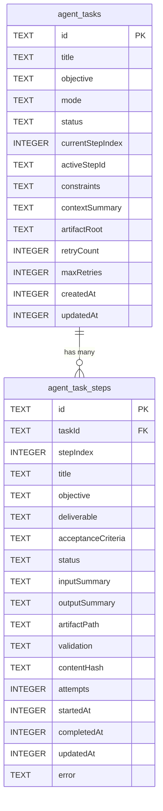
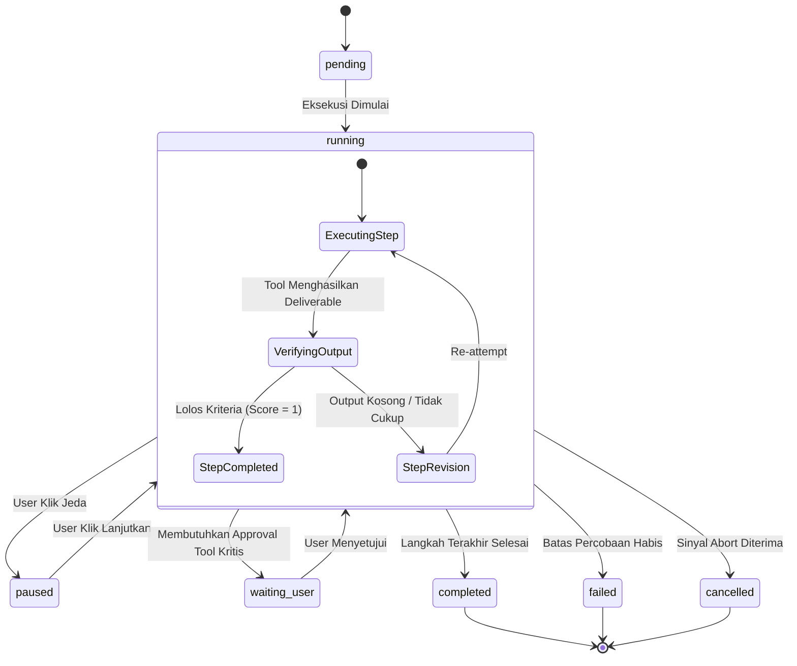

# Tugas Tahan Lama & Alur Kerja Agen (Durable Tasks)

Dokumen ini menjelaskan subsistem **Durable Agent Tasks** (ditampilkan pada antarmuka pengguna sebagai **Agent Workflows**), sebuah mekanisme orkestrasi tugas multi-langkah persisten yang tersimpan di basis data SQLite, memiliki toleransi kegagalan (_fault tolerance_), verifikasi kriteria penyelesaian langkah, serta kemampuan pemulihan (_resume_) saat aplikasi dimuat ulang.

---

## 1. Masalah yang Diselesaikan

Pada agen AI konvensional, tugas multi-langkah yang panjang (misalnya: _"Buatkan proyek web React lengkap dengan 5 halaman, integrasi Tailwind, dan unit testing"_) sering kali rentan terhadap:

- **Koneksi Terputus atau Crash:** Jika aplikasi ditutup di tengah langkah ke-4, seluruh riwayat kerja hilang dan agen harus mengulang dari langkah ke-1.
- **Halusinasi Progres:** Model lupa langkah mana saja yang telah berhasil dieksekusi dan langkah mana yang belum diselesaikan.
- **Ketiadaan Validasi Mutu:** Model menganggap langkah selesai tanpa memeriksa apakah berkas keluaran (_deliverable_) benar-benar memiliki isi yang memadai.

MARK mengatasi hal ini dengan memisahkan definisi tugas ke dalam **Entitas Tugas Tahan Lama (Durable Task Engine)** yang tersimpan secara deterministik pada tabel SQLite `agent_tasks` dan `agent_task_steps`.

---

## 2. Arsitektur Data & Tabel Relasional

Implementasi logika tugas tahan lama terletak pada:

- [`src/renderer/src/api/taskStore.js`](file:///d:/My%20Project/mark-project/mark/src/renderer/src/api/taskStore.js)
- [`src/renderer/src/api/taskExecutor.js`](file:///d:/My%20Project/mark-project/mark/src/renderer/src/api/taskExecutor.js)
- [`src/server/routes/tasks.routes.js`](file:///d:/My%20Project/mark-project/mark/src/server/routes/tasks.routes.js)
- [`src/renderer/src/contexts/TaskWorkflowContext.jsx`](file:///d:/My%20Project/mark-project/mark/src/renderer/src/contexts/TaskWorkflowContext.jsx)



---

## 3. Status Siklus Tugas dan Langkah

### Status Tugas (`agent_tasks.status`)

- `pending`: Tugas telah dibuat namun belum mulai dieksekusi.
- `running`: Langkah aktif sedang dikerjakan oleh ReAct loop.
- `paused`: Tugas dihentikan sementara oleh pengguna.
- `waiting_user`: Menunggu konfirmasi atau masukan pengguna.
- `completed`: Seluruh langkah telah berhasil divalidasi.
- `failed`: Jumlah percobaan ulang melebihi `maxRetries` atau terjadi kegagalan fatal.
- `cancelled`: Dibatalkan secara eksplisit oleh pengguna.

### Status Langkah (`agent_task_steps.status`)

- `pending`: Menunggu giliran eksekusi.
- `running`: Sedang dikerjakan saat ini.
- `needs_revision`: Validasi kriteria tidak terpenuhi, langkah harus diulang.
- `completed`: Berkas keluaran telah diverifikasi dan lolos kriteria.
- `failed`: Mengalami kegagalan setelah batas percobaan habis.
- `skipped`: Dilewati karena dependensi sebelumnya berubah.



---

## 4. Checkpoint Deterministik & Content Hashing

Untuk menghindari eksekusi ulang pada langkah yang sudah selesai (_idempotency_), MARK menghitung hash konten ringan (_FNV-1a 32-bit hash_) terhadap output setiap langkah:

```javascript
// src/renderer/src/api/taskStore.js
export function getAgentTaskContentHash(value = '') {
  const text = String(value)
  let hash = 2166136261
  for (let index = 0; index < text.length; index += 1) {
    hash ^= text.charCodeAt(index)
    hash = Math.imul(hash, 16777619)
  }
  return (hash >>> 0).toString(16).padStart(8, '0')
}
```

Ketika langkah selesai:

1. Hasil output diperiksa oleh `validateAgentTaskStepOutput`.
2. Jika memenuhi panjang minimal (80 karakter untuk langkah dengan kriteria spesifik, atau 20 karakter untuk langkah umum), langkah dinyatakan valid.
3. Hash konten disimpan ke kolom `contentHash`.
4. Jika server restart, sistem dapat memverifikasi integritas deliverable fisik di disk menggunakan hash ini tanpa perlu memanggil model AI ulang.

---

## 5. Alur Pemulihan Pasca-Crash (Crash Recovery)

Ketika aplikasi MARK dibuka kembali setelah ditutup mendadak:

1. Modul `TaskWorkflowContext` memuat daftar tugas dari SQLite (`/api/tasks`).
2. Jika terdapat tugas dengan status `running` atau `paused`:
   - Sistem membaca `currentStepIndex` dan `activeStepId`.
   - Langkah-langkah dengan status `completed` dilewati (_fast-forward_).
   - Ringkasan output dari langkah-langkah sebelumnya disuntikkan ke dalam `contextSummary`.
   - Agen melanjutkan eksekusi tepat dari langkah aktif yang belum selesai.

---

## 6. Antarmuka REST API Tugas

Backend MARK menyediakan route REST terdedikasi di [`src/server/routes/tasks.routes.js`](file:///d:/My%20Project/mark-project/mark/src/server/routes/tasks.routes.js):

| Metode   | Endpoint                                  | Keterangan                                                  |
| :------- | :---------------------------------------- | :---------------------------------------------------------- |
| `GET`    | `/api/tasks`                              | Mengambil seluruh daftar tugas dan progres langkahnya       |
| `POST`   | `/api/tasks`                              | Membuat tugas baru berserta struktur langkah-langkahnya     |
| `GET`    | `/api/tasks/:id`                          | Mengambil detail satu tugas spesifik                        |
| `PATCH`  | `/api/tasks/:id`                          | Memperbarui status tugas (`running`, `paused`, `cancelled`) |
| `POST`   | `/api/tasks/:id/steps/:stepId/checkpoint` | Mencatat checkpoint progres dan hasil verifikasi langkah    |
| `DELETE` | `/api/tasks/:id`                          | Menghapus tugas dan seluruh riwayat langkahnya dari SQLite  |
