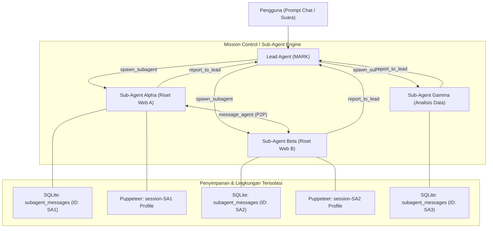
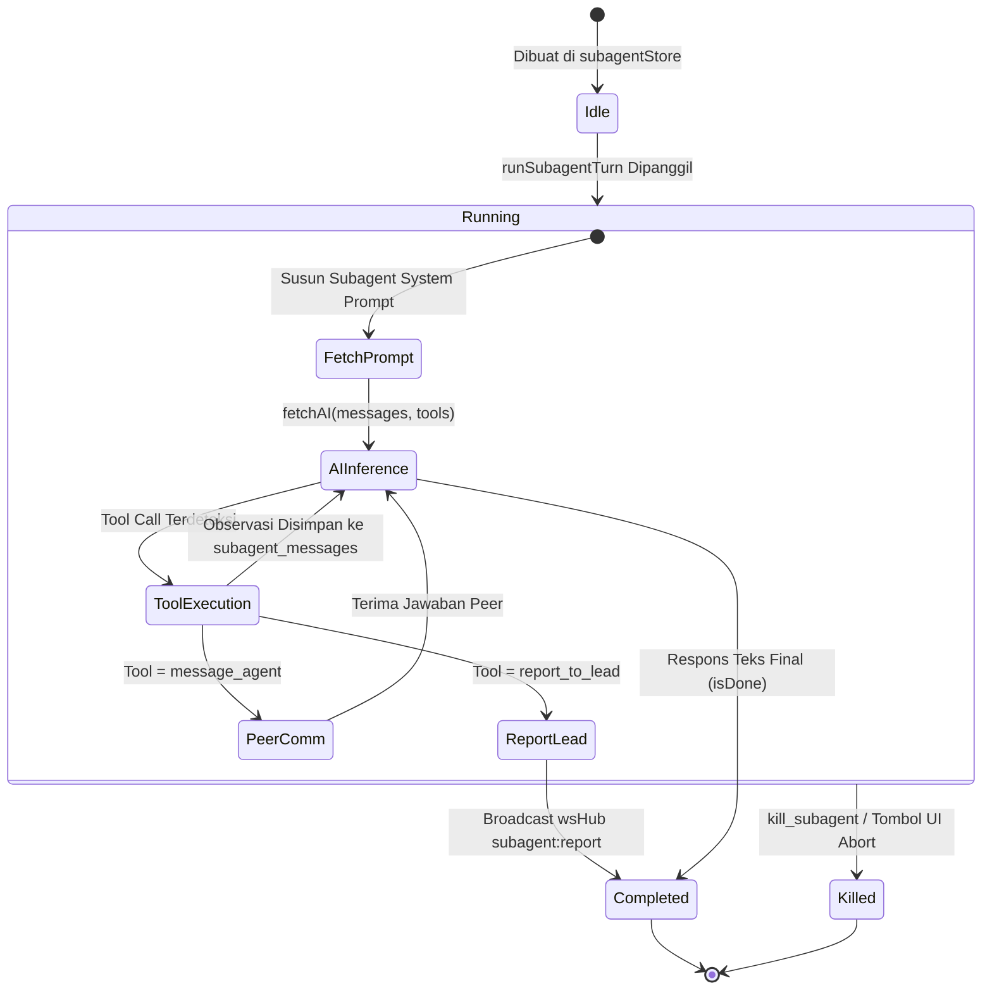
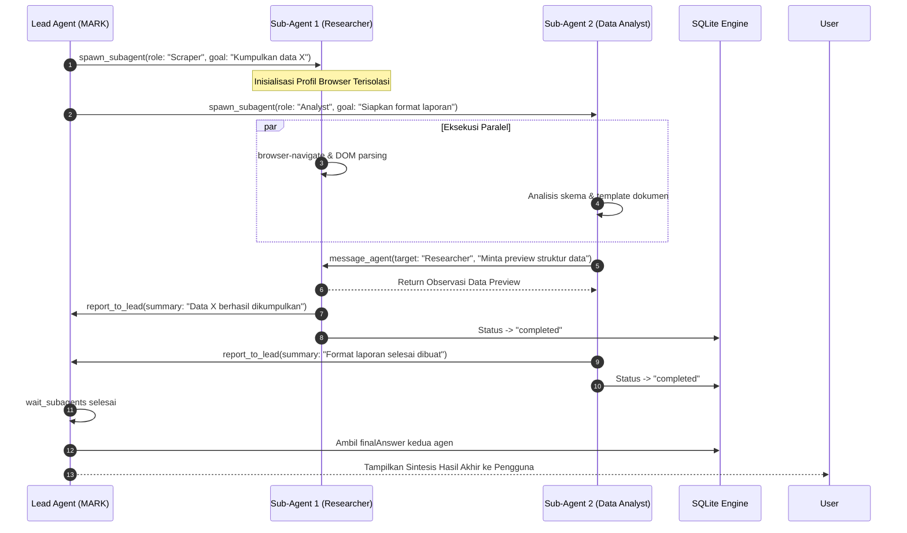

# Mesin Multi-Agen & Orkestrasi Sub-Agen

Dokumen ini menjelaskan arsitektur **Autonomous Multi-Agent Sub-Agent Engine** pada sistem **MARK** (dikenal pada antarmuka pengguna sebagai **Sub-Agents** / **Mission Control**), mencakup siklus hidup pembuatan agen spesialis, orkestrasi paralel, isolasi sesi peramban, komunikasi antar-agen (_inter-agent messaging_), dan pencegahan pemanggilan rekursif.

---

## 1. Filosofi & Desain Multi-Agen

Ketika dihadapkan pada tugas yang kompleks (misalnya riset mendalam di berbagai situs web, perbandingan produk secara simultan, atau analisis dokumen paralel), satu agen monolitik sering kali mengalami hambatan context window dan eksekusi sekuensial yang lambat.

MARK mengimplementasikan sistem **Multi-Agen Hirarkis**:

1. **Lead Agent (Mark):** Agen utama yang berinteraksi langsung dengan pengguna. Bertindak sebagai arsitek tugas, memecah masalah besar menjadi sub-tugas independen, melakukan _batch spawning_, menunggu hasil, dan merangkum kesimpulan akhir.
2. **Sub-Agents (Spesialis Otonom):** Agen turunan yang di-spawn secara dinamis dengan peran (_role_), tujuan (_goal_), dan batasan alat (_allowedTools_) tertentu.
3. **Penyimpanan Terisolasi:** Setiap sub-agen memiliki riwayat pesan mandiri di tabel basis data SQLite `subagents` dan `subagent_messages`, serta profil peramban Chromium terisolasi di disk.



---

## 2. Siklus Hidup Sub-Agen (Lifecycle Management)

Implementasi logika multi-agen terletak di:

- [`src/renderer/src/api/subagent/subagentStore.js`](file:///d:/My%20Project/mark-project/mark/src/renderer/src/api/subagent/subagentStore.js)
- [`src/renderer/src/api/subagent/subagentExecutor.js`](file:///d:/My%20Project/mark-project/mark/src/renderer/src/api/subagent/subagentExecutor.js)
- [`src/renderer/src/api/subagent/subagentPrompt.js`](file:///d:/My%20Project/mark-project/mark/src/renderer/src/api/subagent/subagentPrompt.js)
- [`src/server/routes/subagents.routes.js`](file:///d:/My%20Project/mark-project/mark/src/server/routes/subagents.routes.js)

### Alat Orkestrasi Lead Agent:

- `spawn_subagent`: Membuat dan langsung mengeksekusi sub-agen baru.
- `wait_subagents`: Menghentikan sementara loop Lead Agent hingga satu atau seluruh sub-agen yang ditugaskan menyelesaikan misinya.
- `kill_subagent`: Menghentikan proses sub-agen secara paksa dan mematikan sesi peramban aktifnya.

### Tanpa Batasan Turn (No Turn Limit)

Sub-agen tidak dibatasi oleh jumlah giliran artifisial (`maxTurns`). Agen akan terus mengeksekusi siklus ReAct secara otonom hingga:

- Menghasilkan kesimpulan akhir dan memanggil `report_to_lead`.
- Menghasilkan jawaban final teks tanpa tool call.
- Dibatalkan secara eksplisit oleh Lead Agent atau pengguna melalui UI.



---

## 3. Isolasi Sesi Peramban (Per-Agent Browser Isolation)

Salah satu keunggulan utama MARK adalah kemampuan mengeksekusi automasi web paralel tanpa tabrakan sesi (_cross-session pollution_).

Ketika sub-agen memanggil alat peramban (`browser-navigate`, `browser-click`, `browser-type`):

1. Parameter eksekusi menyertakan `{ sessionId: subagentId }`.
2. Modul [`src/main/browser-agent.js`](file:///d:/My%20Project/mark-project/mark/src/main/browser-agent.js) membuat atau mengaitkan jendela Puppeteer dengan direktori data profil pengguna khusus:
   ```
   C:\Users\<Username>\.config\mark-agent\browser-sessions\<subagentId>\
   ```
3. Cookie, cache, local storage, dan riwayat login sub-agen A tidak akan bercampur dengan sub-agen B maupun jendela peramban utama pengguna.
4. Setiap sesi peramban memancarkan _frame screenshot_ base64 independen ke WebSocket Hub (`browser:preview`), memungkinkan antarmuka pengguna menampilkan banyak kartu Holo-Preview secara bersamaan di dasbor Mission Control.

---

## 4. Protokol Komunikasi Antar-Agen

Sub-agen memiliki dua saluran komunikasi native:

### A. Pelaporan ke Lead Agent (`report_to_lead`)

Digunakan saat sub-agen telah menyelesaikan misi utamanya:

```json
{
  "name": "report_to_lead",
  "arguments": {
    "summary": "Analisis harga selesai. Produk A lebih murah 15% di vendor kedua.",
    "artifact": "C:/Users/.../workspace/comparison.json"
  }
}
```

Saat alat ini dipanggil:

- Status sub-agen diperbarui menjadi `completed` di database.
- Ringkasan disimpan ke kolom `finalAnswer`.
- Sistem memancarkan event WebSocket `subagent:report` ke seluruh klien UI yang terhubung.

### B. Komunikasi Rekan Sejajar (`message_agent`)

Sub-agen dapat bertukar pesan langsung dengan sub-agen lain secara peer-to-peer tanpa perlu menginterupsi Lead Agent:

```json
{
  "name": "message_agent",
  "arguments": {
    "target_agent": "ScraperAgent",
    "message": "Bisa tolong ekstrak bagian tabel spesifikasi teknis dari halaman yang sedang kamu buka?"
  }
}
```

Fungsi `runSubagentTurn` pada agen penerima akan dipicu dengan prefix `[DARI SESAMA SUB-AGENT]: ...`. Setelah agen penerima merespons, jawabannya langsung dikembalikan sebagai observasi bagi agen pemanggil.

---

## 5. Pencegahan Pemanggilan Rekursif (Anti-Recursion Shield)

Untuk mencegah ledakan agen tak terkontrol (_infinite subagent explosion_ atau fork bomb), sub-agen diisolasi dari kemampuan spawning:

Di dalam [`src/renderer/src/api/subagent/subagentExecutor.js`](file:///d:/My%20Project/mark-project/mark/src/renderer/src/api/subagent/subagentExecutor.js):

```javascript
const forbiddenTools = ['spawn_subagent', 'kill_subagent', 'wait_subagents']
```

Setiap skema alat yang dikirimkan ke model saat menjalankan sub-agen disaring secara ketat. Sub-agen tidak akan pernah melihat atau dapat memanggil ketiga fungsi tersebut. Hanya Lead Agent (Mark) yang memiliki wewenang membuat dan membunuh agen turunan.

---

## 6. Struktur Penyimpanan SQLite Sub-Agen

Data sub-agen disimpan secara terpusat pada dua tabel relasional:

### Tabel `subagents`

| Kolom             | Tipe               | Keterangan                                                         |
| :---------------- | :----------------- | :----------------------------------------------------------------- |
| `id`              | `TEXT PRIMARY KEY` | ID unik sub-agen (contoh: `subagent-1712345678`)                   |
| `name`            | `TEXT`             | Nama panggilan agen (contoh: `MarketResearcher`)                   |
| `role`            | `TEXT`             | Deskripsi peran agen                                               |
| `goal`            | `TEXT`             | Sasaran spesifik yang harus dicapai                                |
| `status`          | `TEXT`             | Status siklus (`idle`, `running`, `completed`, `killed`, `failed`) |
| `parentSessionId` | `TEXT`             | ID sesi obrolan induk yang membuat sub-agen                        |
| `allowedTools`    | `TEXT (JSON)`      | Daftar nama alat yang diizinkan untuk agen ini                     |
| `turnCount`       | `INTEGER`          | Jumlah iterasi ReAct yang telah dilalui                            |
| `finalAnswer`     | `TEXT`             | Ringkasan laporan akhir hasil misi                                 |

### Tabel `subagent_messages`

| Kolom        | Tipe                  | Keterangan                                                 |
| :----------- | :-------------------- | :--------------------------------------------------------- |
| `id`         | `INTEGER PRIMARY KEY` | Kunci utama terurut otomatis                               |
| `subagentId` | `TEXT`                | Relasi kunci asing ke `subagents.id`                       |
| `sender`     | `TEXT`                | Identitas pengirim (`mark`, `subagent`, `peer`, `user`)    |
| `role`       | `TEXT`                | Peran pesan OpenAI (`system`, `user`, `assistant`, `tool`) |
| `content`    | `TEXT`                | Isi teks pesan atau ringkasan tindakan                     |
| `thought`    | `TEXT`                | Isi penalaran internal model (_reasoning/think_)           |
| `tool_calls` | `TEXT (JSON)`         | Detail panggilan fungsi jika ada                           |
| `created_at` | `INTEGER`             | Stempel waktu UNIX                                         |

---

## 7. Diagram Komunikasi Multi-Agen Paralel


