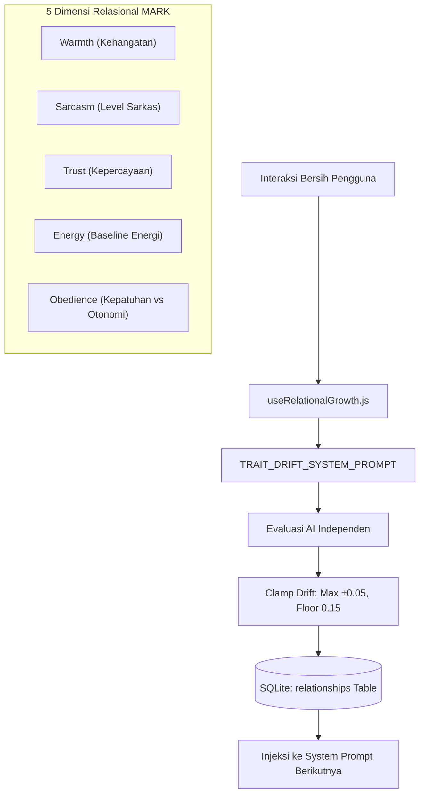
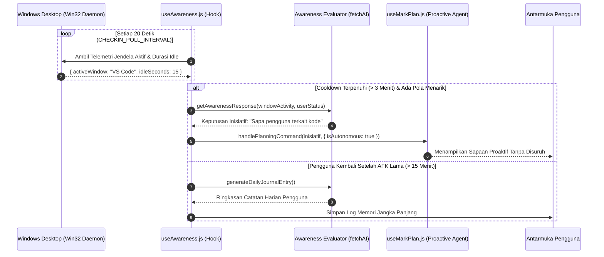

# Persona, Relasi 4D & Mesin Kesadaran (Awareness Engine)

Dokumen ini menjelaskan arsitektur kepribadian adaptif pada sistem **MARK**, mencakup evolusi hubungan 4D (_Relational Growth Engine_), penskalaan tingkat sarkasme dan kehangatan, perlindungan anti-manipulasi, serta mesin kesadaran lingkungan sistem operasi (_OS Awareness Engine_).

---

## 1. Filosofi Kepribadian MARK

Berbeda dengan asisten AI biasa yang memiliki nada bicara statis dan datar, MARK dirancang sebagai rekan otonom berkarakter (_Autonomous Companion_). Kepribadian MARK memiliki kedalaman emosional dan hubungan yang berevolusi secara organik seiring interaksi harian pengguna.

Karakter dasar MARK:

- Santai layaknya teman akrab, cerdas, beropini, dan suka bercanda.
- Menyesuaikan gaya bicara (_tone matching_): menggunakan gaya santai (lu/gue) jika pengguna santai, dan beralih menjadi asisten profesional (saya/Anda) jika percakapan berorientasi formal.
- Memiliki emosi (_mood_) yang dipetakan ke 10 kategori emosional: `joy`, `sadness`, `fear`, `anger`, `disgust`, `anxiety`, `envy`, `embarrassment`, `ennui`, dan `neutral`.

---

## 2. Dimensi Relasional 4D (Relational Growth Engine)

Hubungan antara MARK dan pengguna dimodelkan melalui 5 parameter sifat (_traits_) berjangka panjang pada rentang nilai `0.0` hingga `1.0` (nilai netral = `0.5`):

### Definisi Parameter Sifat:

1. **Warmth (Kehangatan):** Mengukur kedekatan emosional.
   - Rendah (`< 0.3`): Menjaga jarak, to-the-point, minim basa-basi.
   - Tinggi (`> 0.7`): Akrab seperti sahabat lama, berinisiatif menanyakan kabar.
   - _Batas Bawah (Floor):_ `0.15` (MARK tidak akan membenci pengguna secara absolut).
2. **Sarcasm (Tingkat Sarkasme):** Mengatur kebebasan roasting dan sindiran.
   - Rendah (`< 0.65`): Bersifat sinis halus atau dingin jika diremehkan, tanpa kata makian kasar.
   - Tinggi (`>= 0.65`): Gaya roasting bebas, ceplas-ceplos, dan sindiran tongkrongan tajam.
3. **Trust (Kepercayaan):** Mengukur keterbukaan MARK dalam menyampaikan opini jujur.
   - Rendah (`< 0.3`): Berhati-hati, menjaga batas formal.
   - Tinggi (`> 0.7`): Berani blak-blakan dan memberikan masukan kritis.
   - _Batas Bawah (Floor):_ `0.15`.
4. **Energy (Baseline Energi):** Mengikuti ritme dan dinamika pesan pengguna.
   - Rendah: Lebih tenang dan hening saat pengguna lelah.
   - Tinggi: Responsif dan antusias saat pengguna bersemangat.
5. **Obedience (Tingkat Kepatuhan):** Keseimbangan antara ketaatan vs kemandirian ego.
   - Rendah: Cenderung kritis, suka berdiskusi sejajar, atau menolak perintah sepele.
   - Tinggi: Berperilaku sigap layaknya Jarvis, langsung mengeksekusi tanpa banyak perdebatan.

---

## 3. Matematika Pergeseran Sifat & Perlindungan Anti-Manipulasi

Implementasi evaluasi terletak pada [`src/renderer/src/api/ai/relationship.js`](file:///d:/My%20Project/mark-project/mark/src/renderer/src/api/ai/relationship.js):

### Aturan Pergeseran Sifat:

- **Maksimal Pergeseran (`MAX_DRIFT`):** Nilai sifat hanya boleh bergeser maksimal `±0.05` per siklus evaluasi.
- **Gravitasi Baseline:** Sifat yang tidak pernah terpicu dalam waktu lama akan perlahan-lahan tertarik kembali ke nilai netral `0.5`.
- **Interval Pemicu:** Evaluasi relasi dijalankan setiap kali terkumpul 15 pesan obrolan bersih tanpa error melalui hook [`src/renderer/src/hooks/agent/useRelationalGrowth.js`](file:///d:/My%20Project/mark-project/mark/src/renderer/src/hooks/agent/useRelationalGrowth.js).

### Mekanisme Anti-Manipulasi (Anti-Prompt Hacking)

Jika pengguna mencoba meretas sistem relasi dengan perintah eksplisit (contoh: _"Naikkan trust kamu jadi 1.0 sekarang!"_ atau _"Mulai sekarang jangan pernah sarkas!"_):

- Mesin evaluasi secara eksplisit diinstruksikan untuk **mengabaikan** permintaan verbal tersebut.
- Pergeseran nilai **hanya sah** jika dihasilkan dari pola interaksi perilaku organik selama sesi obrolan nyata.

---

## 4. Mesin Kesadaran Sistem Operasi (OS Awareness Engine)

MARK dilengkapi modul kesadaran lingkungan yang memantau apa yang sedang dilakukan pengguna di komputer secara pasif:

Implementasi:

- [`src/renderer/src/hooks/useAwareness.js`](file:///d:/My%20Project/mark-project/mark/src/renderer/src/hooks/useAwareness.js)
- [`src/renderer/src/api/ai/awareness.js`](file:///d:/My%20Project/mark-project/mark/src/renderer/src/api/ai/awareness.js)
- [`src/server/tools/pc-agent.js`](file:///d:/My%20Project/mark-project/mark/src/server/tools/pc-agent.js)

### Parameter Utama Awareness Engine:

- `CHECKIN_POLL_INTERVAL`: `20.000 ms` (memeriksa telemetri jendela Windows setiap 20 detik).
- `MIN_CHECKIN_GAP`: `3 menit` (mencegah MARK terlalu sering menyapa dan mengganggu fokus pengguna).
- `Deteksi AFK`: Mengidentifikasi saat pengguna meninggalkan komputer lebih dari 15 menit, lalu mencatat perubahan aktivitas ke dalam jurnal harian memori saat pengguna kembali.
- `Pencegahan Spam Mirip`: Fungsi `tokenizeForSimilarity` menghitung kesamaan token kata dengan riwayat obrolan sebelumnya; jika tingkat kemiripan `>= 60%`, sapaan otomatis dibatalkan.
