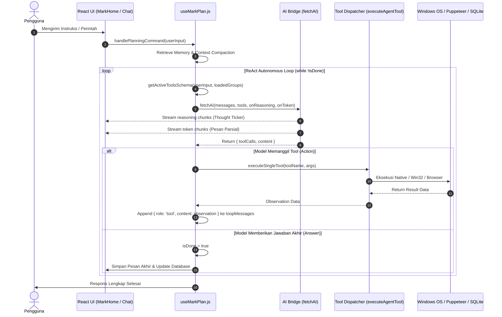
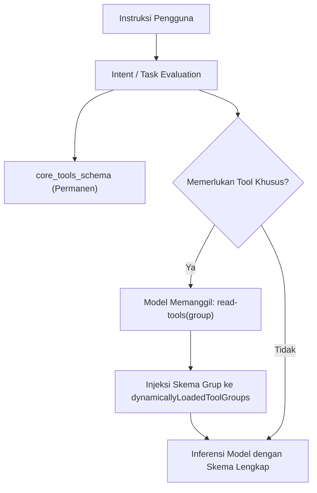
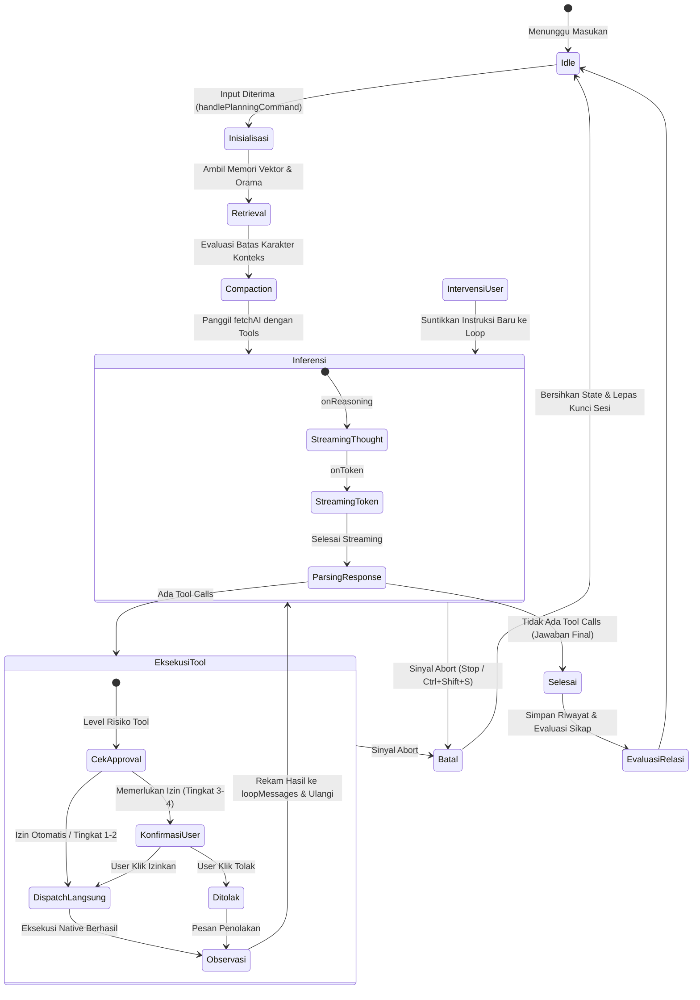

# Siklus ReAct & Eksekusi Perencanaan

Dokumen ini menjelaskan arsitektur **ReAct Loop (Reasoning + Acting)** pada sistem **MARK**, merinci alur kognitif siklus pemikiran (_Thought_), tindakan (_Action_), dan observasi (_Observation_), resolusi skema alat OpenAPI dinamis, streaming token dan reasoning via SSE, penanganan intervensi pengguna (_in-flight intervention_), serta mekanisme pembatalan (_graceful cancellation_).

---

## 1. Konsep Dasar ReAct Loop MARK

Berbeda dengan model percakapan tanya-jawab (_single-turn stateless_), agen otonom MARK mengeksekusi tugas melalui pola **ReAct (Reasoning + Acting)** iteratif. Agen menganalisis kondisi awal pengguna, merumuskan pemikiran logis (_Thought_), memilih dan memanggil alat native (_Action_), menerima umpan balik sistem dari hasil eksekusi alat (_Observation_), dan mengulangi siklus tersebut secara otonom sampai tujuan akhir tercapai atau pengguna melakukan intervensi.

Implementasi loop utama diatur di dalam hook React:

- [`src/renderer/src/hooks/agent/useMarkPlan.js`](file:///d:/My%20Project/mark-project/mark/src/renderer/src/hooks/agent/useMarkPlan.js)
- [`src/renderer/src/hooks/agent/executeAgentTool.js`](file:///d:/My%20Project/mark-project/mark/src/renderer/src/hooks/agent/executeAgentTool.js)
- [`src/renderer/src/api/ai/planning.js`](file:///d:/My%20Project/mark-project/mark/src/renderer/src/api/ai/planning.js)
- [`src/renderer/src/api/tools/index.js`](file:///d:/My%20Project/mark-project/mark/src/renderer/src/api/tools/index.js)



---

## 2. Struktur Data Siklus: Thought, Action, Observation

Setiap putaran dalam loop ReAct memperkaya riwayat percakapan (`loopMessages`) dengan struktur pesan standar yang dipahami oleh model bahasa:

### A. Reasoning (Thought)

Pemikiran internal model diekstraksi melalui callback `onReasoning` dari AI Bridge. Jika model mendukung pemikiran eksplisit (seperti Gemini Flash Thinking atau model lokal dengan tag `<think>`), teks reasoning dialirkan secara langsung ke komponen antarmuka pengguna `ThoughtTicker.jsx` tanpa memblokir teks respons akhir.

### B. Action (Tool Calls)

Ketika model memutuskan membutuhkan data eksternal atau manipulasi sistem operasi, model mengirimkan struktur OpenAPI `tool_calls`:

```json
{
  "tool_calls": [
    {
      "id": "call_987234",
      "type": "function",
      "function": {
        "name": "read-file",
        "arguments": "{\"path\":\"d:/project/src/index.js\"}"
      }
    }
  ]
}
```

### C. Observation (Tool Execution Result)

Setelah alat dieksekusi oleh dispatcher native, hasilnya dikembalikan ke riwayat pesan dengan peran `tool`:

```json
{
  "role": "tool",
  "tool_call_id": "call_987234",
  "name": "read-file",
  "content": "export const app = express();\napp.listen(3000);"
}
```

Hasil observasi ini menjadi masukan langsung bagi model pada iterasi berikutnya untuk memutuskan apakah tujuan sudah selesai atau membutuhkan langkah investigasi lebih lanjut.

---

## 3. Resolusi Skema Alat OpenAPI Dinamis (Dynamic Tool Schema)

Memasukkan seluruh definisi alat ke dalam system prompt pada setiap turn akan menghabiskan jendela konteks (_context window_) dan meningkatkan latensi inferensi. MARK menerapkan strategi pemuatan bertingkat (_tiered tool loading_):

1. **Core Tools (Selalu Tersedia):** Alat fundamental seperti manipulasi berkas (`read-file`, `write-file`, `replace-content`, `list-directory`), pencarian web dasar, pembaca memori, dan delegasi sub-agen selalu dimuat dalam `core_tools_schema`.
2. **Tool Groups Khusus (Pemuatan Sesuai Permintaan):** Alat tingkat lanjut seperti automasi mouse/keyboard Win32 (`pc_automation`), automasi peramban interaktif (`advanced_browser`), dan Google Workspace (`google_workspace`) diisolasi dalam modul terpisah.
3. **Lazy Discovery via `read-tools`:** Model dapat memanggil `read-tools({ group: "pc_automation" })`. Ketika dipanggil, sistem menandai kelompok tersebut ke dalam `dynamicallyLoadedToolGroups`. Pada langkah loop berikutnya, `getActiveToolsSchema` secara dinamis memasukkan skema OpenAPI kelompok tersebut ke dalam payload inferensi.
4. **Custom Plugin Schema:** Plugin pihak ketiga di direktori plugin lokal diinjeksi secara otomatis sebagai fungsi OpenAPI berformat `plugin-<namaPlugin>-<namaAksi>`.



---

## 4. Siklus Eksekusi Loop `useMarkPlan.js`

Alur kerja iterasi `while (!isDone && !sessionAbortController.signal.aborted)` diimplementasikan sebagai berikut:

```javascript
// Cuplikan konseptual dari src/renderer/src/hooks/agent/useMarkPlan.js
while (!isDone && !sessionAbortController.signal.aborted) {
  // 1. Periksa intervensi pengguna yang masuk saat proses berlangsung
  if (sessionRecord.interventions?.length > 0) {
    const interventions = sessionRecord.interventions.splice(0).join('\n')
    loopMessages.push({ role: 'user', content: `[USER INTERVENTION]: ${interventions}` })
    execSteps.push({ task: `Intervensi User: ${interventions}` })
  }

  stepCount++

  // 2. Siapkan skema alat OpenAPI aktif
  const activeTools = await getActiveToolsSchema(
    userInput + ' ' + (activeTaskObjectiveRef.current || ''),
    dynamicallyLoadedToolGroups
  )

  // 3. Jalankan inferensi AI dengan streaming token & reasoning
  const streamResult = await fetchAI(loopMessages, true, {
    tools: activeTools,
    signal: sessionAbortController.signal,
    onReasoning: (chunk) => {
      // Perbarui pemikiran real-time di UI
    },
    onToken: (token) => {
      // Perbarui token teks respons di UI
    }
  })

  // 4. Evaluasi hasil: Tool Call atau Jawaban Selesai
  if (streamResult.toolCalls && streamResult.toolCalls.length > 0) {
    // Eksekusi tiap tool call
    for (const call of streamResult.toolCalls) {
      const toolResult = await executeSingleTool(
        call.function.name,
        call.function.arguments,
        context
      )
      loopMessages.push({
        role: 'tool',
        tool_call_id: call.id,
        name: call.function.name,
        content: toolResult.resultString
      })
    }
  } else {
    // Model menghasilkan respons teks tanpa tool call: Misi selesai
    isDone = true
    finalContentAccumulator = streamResult.content
  }
}
```

---

## 5. Penanganan Intervensi Pengguna (In-Flight Intervention)

MARK mendukung fitur pengarahan balik saat loop otonom sedang berjalan tanpa mematikan sesi (_session steering_).

Jika pengguna mengetik instruksi tambahan di bar obrolan saat MARK sedang menjalankan eksekusi (misalnya: _"jangan hapus file itu, buat backup dulu"_):

1. Sistem mendeteksi `activeSessionsRef.has(sessionId)`.
2. Alih-alih membuat turn baru, sistem memanggil `handleIntervention(userInput, sessionId)`.
3. Teks intervensi dimasukkan ke dalam antrean `sessionRecord.interventions`.
4. Pada siklus `while` berikutnya, intervensi disuntikkan ke dalam `loopMessages` sebagai pesan dengan prefix `[USER INTERVENTION]: ...`.
5. Model langsung membaca arahan baru tersebut pada langkah penalaran berikutnya dan menyesuaikan rencana tindakan.

---

## 6. Pembatalan Elegan (Graceful Cancellation) & Abort Controller

Pengguna dapat menghentikan eksekusi agen kapan saja melalui tombol Stop di UI atau kombinasi tombol darurat:

- Setiap sesi memiliki instance `AbortController` independen yang tersimpan di `activeSessionsRef`.
- Sesi utama (`sessionId: 1`) memetakan signal ke `abortControllerRef.current`.
- Pemanggilan `handleStop(sessionId)` melakukan tindakan berjenjang:
  1. Memanggil `session.abortController.abort()`.
  2. Membatalkan koneksi HTTP streaming yang sedang berjalan ke penyedia AI via `window.api.abortFetchAI()`.
  3. Menutup instans peramban aktif terkait sesi via `window.api.browserClose({ sessionId })`.
  4. Memperbarui status tugas tahan lama (_durable task_) menjadi `cancelled` di database SQLite.
  5. Mengembalikan pesan pembatalan ramah di obrolan: _"Eksekusi dibatalkan atas permintaan pengguna."_

---

## 7. Diagram Status Siklus ReAct



---

## 8. Ringkasan Teknis Penting

| Parameter / Fitur           | Nilai / Kebijakan                                      | Lokasi Kode                                 |
| :-------------------------- | :----------------------------------------------------- | :------------------------------------------ |
| **Batas Turn (`maxTurns`)** | Tidak Terbatas (berjalan hingga selesai / dibatalkan)  | `useMarkPlan.js` line 1256                  |
| **Batas Karakter Konteks**  | 525.000 karakter (~131.000 token)                      | `src/renderer/src/api/ai/contextManager.js` |
| **Toleransi Retry Error**   | Maksimal 50 kali kesalahan berturut-turut              | `useMarkPlan.js` line 1276                  |
| **Streaming Engine**        | Server-Sent Events (SSE) dengan parser JSON / chunk    | `src/renderer/src/api/ai/core.js`           |
| **Intervensi Real-time**    | Antrean non-blocking via `sessionRecord.interventions` | `useMarkPlan.js` line 165                   |
