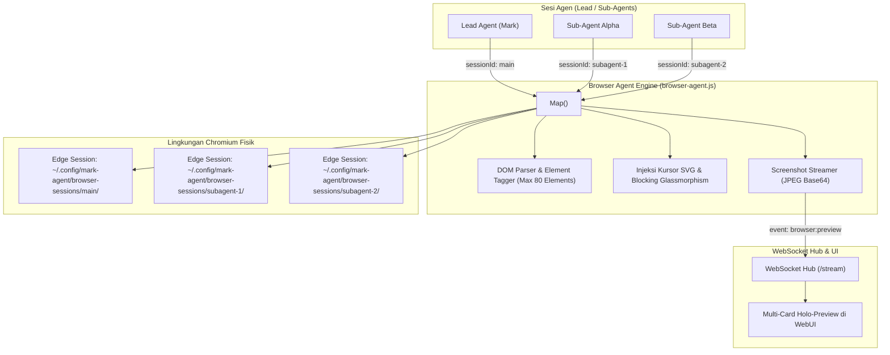

# Automasi Peramban & Engine Puppeteer Multi-Sesi

Dokumen ini membedah arsitektur **Browser Automation Engine** pada sistem **MARK**, merinci isolasi multi-sesi Chromium via `puppeteer-core`, parser DOM dengan penandaan elemen interaktif (`data-mark-id`), injeksi kursor animasi dan overlay pemblokir interaksi, penanganan binding input React 18+, serta penyiaran cuplikan visual (_Holo-Preview Stream_) melalui WebSocket.

---

## 1. Arsitektur Engine Peramban Terisolasi

MARK menggunakan [`puppeteer-core`](https://github.com/puppeteer/puppeteer) yang dihubungkan langsung ke instalasi Microsoft Edge atau Google Chrome yang sudah ada di Windows, tanpa perlu mengunduh Chromium biner berukuran ratusan megabyte:

Implementasi:

- Berkas Utama: [`src/main/browser-agent.js`](file:///d:/My%20Project/mark-project/mark/src/main/browser-agent.js)
- Widget Pratinjau Frontend: [`src/renderer/src/components/BrowserPreviewWidget.jsx`](file:///d:/My%20Project/mark-project/mark/src/renderer/src/components/BrowserPreviewWidget.jsx)



---

## 2. Deteksi Biner Peramban Windows

Fungsi `getEdgePath()` secara berurutan mencari lokasi executable peramban Chromium yang terpasang di sistem Windows:

1. Microsoft Edge (Program Files x86, Program Files 64-bit, atau Local AppData).
2. Google Chrome (Program Files, Local AppData).
3. Brave Browser.
4. Vivaldi Browser.
5. Fallback ke nama executable `msedge.exe` pada PATH sistem operasi.

---

## 3. Penandaan Elemen DOM Interaktif (`data-mark-id`)

Model bahasa besar (LLM) tidak dapat secara efisien membaca seluruh pohon DOM HTML yang berukuran megabyte. MARK mengatasi tantangan ini dengan algoritma pemangkasan cerdas:

1. **Penyaringan Elemen Interaktif:** Skrip injeksi memindai elemen-elemen yang dapat berinteraksi dengan pengguna: `<a>`, `<button>`, `<input>`, `<textarea>`, `<select>`, dan elemen dengan atribut `role="button"` atau `onclick`.
2. **Pemberian Tag ID Unik:** Maksimal 80 elemen teratas yang terlihat (_visible_) pada viewport ditandai dengan atribut `data-mark-id="1"`, `data-mark-id="2"`, dan seterusnya.
3. **Penyusunan Peta DOM Ringkas:** Elemen-elemen tersebut dirangkum menjadi daftar teks terstruktur yang dikirimkan ke model AI:
   ```text
   [1] Input "Cari di Google" (name="q")
   [2] Button "Telusuri dengan Google"
   [3] Link "Tentang Kami" (href="/about")
   ```
4. **Eksekusi Tindakan Presisi:** Ketika agen ingin mengklik tombol, agen cukup memanggil `browser-click({ markId: 2, sessionId: "subagent-1" })`. Sistem langsung mengeksekusi klik pada elemen dengan atribut `[data-mark-id="2"]` tanpa ambiguitas selektor CSS kompleks.

---

## 4. Injeksi Kursor Animasi & Overlay Glassmorphism

Untuk memberikan pengalaman visual transparan bagi pengguna:

- **Overlay Glassmorphism:** Saat peramban dioperasikan dalam mode non-headless, MARK menyuntikkan layer CSS transparan untuk mencegah pengguna secara tidak sengaja mengklik halaman web saat otomasi agen sedang berlangsung.
- **Kursor SVG Animasi:** MARK menginjeksi elemen kursor SVG khusus ke dalam DOM halaman web. Setiap kali agen bergerak atau mengklik, kursor virtual berpindah dengan animasi mulus dan menampilkan cincin efek ripple pada koordinat target.
- **Mode Buka Kunci Pengguna (`browser-ask-user`):** Jika situs web menampilkan verifikasi captcha Cloudflare atau formulir login 2FA yang rumit, agen dapat mengaktifkan mode minta bantuan pengguna. Overlay dilepas sementara, memungkinkan pengguna menyelesaikan captcha secara manual sebelum agen melanjutkan tugasnya.

---

## 5. Bypass Binding Input React 18+

Pada situs web modern yang dibangun dengan React 18, Vue, atau Angular, manipulasi langsung nilai input (`element.value = "teks"`) sering kali tidak memicu pembaruan state internal framework (_virtual DOM desynchronization_).

MARK mengimplementasikan bypass khusus pada fungsi `browser-type`:

```javascript
// Memanggil setter native prototype HTMLInputElement
const nativeInputValueSetter = Object.getOwnPropertyDescriptor(
  window.HTMLInputElement.prototype,
  'value'
).set
nativeInputValueSetter.call(element, text)

// Memicu event input dan change dengan bubbles: true
element.dispatchEvent(new Event('input', { bubbles: true }))
element.dispatchEvent(new Event('change', { bubbles: true }))
```

Hal ini memastikan formulir pencarian dan input login pada aplikasi web modern langsung merespons ketikan agen tanpa gagal validasi.

---

## 6. Penyiaran Cuplikan Visual Real-time (Holo-Preview Stream)

Setiap sesi peramban yang sedang aktif secara berkala menangkap cuplikan layar halaman web:

- Format: JPEG terkompresi dengan pengkodean string Base64.
- Penyiaran: Dipancarkan ke WebSocket Hub `/stream` dengan nama event `browser:preview`.
- Payload menyertakan `sessionId`, `url`, `title`, dan `previewData` (dataURL gambar).
- Komponen frontend `BrowserPreviewWidget.jsx` menangkap event ini dan merendernya dalam panel mengambang holografis (_Holo-Card_), memungkinkan pengguna memantau proses penelusuran web secara visual tanpa harus membuka jendela peramban fisik.

---

## 7. Manajemen Siklus Hidup & Keamanan Sesi

- **Batas Waktu Idle (5 Menit):** Jika sebuah sesi peramban tidak menerima perintah baru selama 5 menit (`resetSessionIdleTimeout`), peramban akan ditutup secara otomatis untuk menghemat memori RAM komputer.
- **Batas Waktu Pemuatan (60 Detik):** Setiap navigasi halaman dibatasi batas waktu maksimal 60 detik untuk mencegah agen hang pada halaman web yang lambat.
- **Pemblokiran Jendela Popup:** Flag Chromium `--disable-popup-blocking=false` dan penanganan event `page.on('popup')` secara otomatis menutup tab liar atau iklan tak diinginkan.
