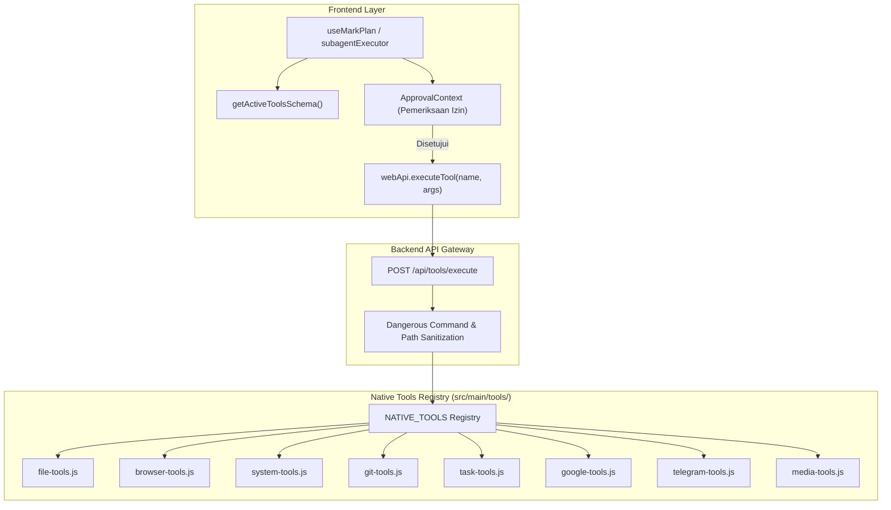

# Registri Alat Native & Sistem Plugin

Dokumen ini menjelaskan arsitektur **Native Tools Registry** pada sistem **MARK**, merinci komposisi modul alat per kategori, jembatan eksekusi REST API dan WebSocket, klasifikasi tingkat risiko (_Security Tiers_), filter perintah berbahaya, serta ekosistem plugin dinamis.

---

## 1. Arsitektur Registri Alat (Tool Facade)

MARK memisahkan implementasi alat native ke dalam modul-modul modular di [`src/main/tools/`](file:///d:/My%20Project/mark-project/mark/src/main/tools/) dan menyatukannya melalui satu titik komposisi terpusat di [`src/main/tools/index.js`](file:///d:/My%20Project/mark-project/mark/src/main/tools/index.js):

```javascript
// src/main/tools/index.js
export const NATIVE_TOOLS = {
  ...fileTools,
  ...browserTools,
  ...systemTools,
  ...gitTools,
  ...taskTools,
  ...googleTools,
  ...telegramTools,
  ...mediaTools
}
```

Frontend di `src/renderer/` berkomunikasi dengan backend melalui panggilan REST `/api/tools/execute` yang ditangani oleh [`src/server/routes/tools.routes.js`](file:///d:/My%20Project/mark-project/mark/src/server/routes/tools.routes.js).



---

## 2. Kategori Modul Alat Native

### A. Modul Berkas (`file-tools.js`)

Mengelola manipulasi berkas dan direktori lokal dengan validasi path ketat:

- `read-file`: Membaca konten teks atau dataURL berkas biner.
- `write-file`: Menulis berkas baru dengan pembuatan direktori otomatis.
- `replace-content`: Mengganti blok teks tertentu dalam berkas tanpa merusak sisa kode.
- `list-directory`: Menjelajahi isi pohon direktori lokal.
- `search-files`: Mencari berkas dengan pola glob atau regex cepat via `ripgrep`/`fd`.
- `diff-file`: Menghasilkan perbandingan diff sebelum perubahan diterapkan.

### B. Modul Peramban (`browser-tools.js`)

Menghubungkan agen ke engine Puppeteer Core terisolasi:

- `browser-navigate`: Membuka URL target dan menunggu pemuatan DOM.
- `browser-click`: Mengklik elemen interaktif berdasarkan nomor `data-mark-id`.
- `browser-type`: Mengetik teks ke dalam elemen formulir atau editor input.
- `browser-screenshot`: Menangkap cuplikan layar halaman web aktif.
- `browser-extract`: Mengekstrak teks bersih dan struktur elemen halaman.
- `browser-close`: Menutup jendela peramban sesi tertentu.

### C. Modul Sistem & Shell (`system-tools.js`)

Menjalankan perintah Windows OS dan otomatisasi tingkat desktop:

- `run-powershell`: Menjalankan perintah PowerShell pada direktori aktif.
- `read-desktop`: Membaca teks dan elemen jendela yang sedang aktif di layar Windows.
- `system-info`: Mengambil status CPU, RAM, disk, dan baterai komputer.
- `take-screenshot`: Menangkap cuplikan layar penuh desktop Windows.

### D. Modul Git (`git-tools.js`)

Manajemen repositori source control langsung:

- `git-status`: Memeriksa perubahan branch dan staging area.
- `git-diff`: Membaca rincian perbedaan baris kode yang belum di-commit.
- `git-commit`: Membuat commit lokal dengan pesan deskriptif.
- `git-revert`: Mengembalikan perubahan berkas ke status commit sebelumnya.

### E. Modul Daemon Tugas Latar Belakang (`task-tools.js`)

Mengelola proses CLI jangka panjang (misalnya dev server, build watcher):

- Menjalankan proses secara asinkron tanpa memblokir sesi percakapan.
- Mengalirkan log keluaran stdout/stderr secara real-time via WebSocket.
- Menghentikan proses melalui pengiriman sinyal kill PID.

### F. Modul Integrasi Eksternal

- `google-tools.js`: Mengakses Google Calendar, membaca dan mengirim Gmail, serta mengunduh berkas Google Drive dengan autentikasi OAuth2.
- `telegram-tools.js`: Mengirim pesan, foto, dan dokumen dari komputer pengguna ke chat Telegram via bot.
- `media-tools.js`: Sintesis suara real-time via Edge-TTS dan pencarian transkrip YouTube.

---

## 3. Klasifikasi Keamanan & Gerbang Izin (4-Tier Security Tiers)

Sebelum alat native dieksekusi di komputer pengguna, sistem memeriksa tingkat risikonya melalui `checkToolApproval`:

| Tier       | Tingkat Risiko      | Contoh Alat                                       | Kebijakan Eksekusi                                    |
| :--------- | :------------------ | :------------------------------------------------ | :---------------------------------------------------- |
| **Tier 1** | Aman / Read-Only    | `read-file`, `list-directory`, `system-info`      | Otomatis dieksekusi tanpa konfirmasi                  |
| **Tier 2** | Modifikasi Lokal    | `write-file`, `browser-navigate`, `browser-click` | Otomatis jika dalam Auto Mode; konfirmasi jika manual |
| **Tier 3** | Perintah Eksternal  | `run-powershell`, `git-commit`, `send-telegram`   | Menampilkan dialog approval detail perintah           |
| **Tier 4** | Kritis / Destruktif | `delete-file`, format disk, modifikasi registry   | Wajib konfirmasi eksplisit dari pengguna              |

### Filter Perintah Berbahaya (`isDangerousCommand`)

Fungsi `isDangerousCommand` di `system-tools.js` memindai string perintah sebelum dikirim ke shell. Perintah yang mengandung pola berbahaya (seperti `Format-Volume`, `Remove-Item -Recurse C:\`, `rmdir /s /q`, manipulasi SAM Windows) akan diblokir secara otomatis demi keamanan data pengguna.

---

## 4. Sistem Plugin Eksternal (Dynamic Plugin Engine)

MARK mendukung sistem plugin eksternal yang dapat diinstal tanpa harus mengubah kode inti server:

- Setiap plugin disimpan dalam direktori `~/.config/mark-agent/plugins/<nama-plugin>/`.
- Plugin mendefinisikan berkas konfigurasi `manifest.json` yang berisi nama aksi, deskripsi OpenAPI, dan skrip eksekusi.
- Backend menyediakan endpoint eksekusi di `/api/plugins/execute`.
- Saat aktif, aksi-aksi plugin secara otomatis dipetakan ke skema OpenAPI berformat `plugin-<namaPlugin>-<namaAksi>` dan dapat dipanggil langsung oleh loop ReAct MARK.
