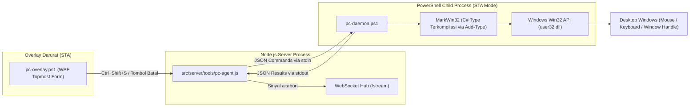

# Otomatisasi Desktop & Daemon C# Win32

Dokumen ini menjelaskan subsistem **Windows PC Automation** pada sistem **MARK**, merinci arsitektur daemon persisten C# Win32, komunikasi IPC berbasis stream standar (stdin/stdout), injeksi masukan tingkat rendah (_SendInput Unicode_), manajemen jendela desktop, serta sistem penghentian darurat (_Emergency Abort Overlay_).

---

## 1. Arsitektur Daemon PC (Persistent Win32 Bridge)

Sebagian besar asisten AI di pasar tidak dapat berinteraksi langsung dengan aplikasi desktop Windows karena keterbatasan sandbox peramban atau lingkungan kontainer cloud.

MARK memecahkan masalah ini dengan menjalankan daemon lokal persisten:

- Komponen Server: [`src/server/tools/pc-agent.js`](file:///d:/My%20Project/mark-project/mark/src/server/tools/pc-agent.js)
- Skrip Daemon PowerShell + C#: [`src/main/pc-agent-scripts/pc-daemon.ps1`](file:///d:/My%20Project/mark-project/mark/src/main/pc-agent-scripts/pc-daemon.ps1)
- Skrip Overlay Darurat: [`src/main/pc-agent-scripts/pc-overlay.ps1`](file:///d:/My%20Project/mark-project/mark/src/main/pc-agent-scripts/pc-overlay.ps1)



---

## 2. Pustaka Terkompilasi C# `MarkWin32`

Saat pertama kali di-spawn, `pc-daemon.ps1` mengompilasi kode C# langsung ke dalam memori PowerShell menggunakan `Add-Type`. Ini memberikan kecepatan eksekusi setara native C/C++ tanpa overhead kompilasi eksternal:

### Kapabilitas Inti `MarkWin32`:

1. **`SendInput` Unicode Keyboard Simulation:**
   - Mengetik teks UTF-16 secara instan tanpa terpengaruh layout keyboard atau status CapsLock.
   - Mendukung penekanan kombinasi tombol pintasan (_shortcuts_) seperti `Ctrl+C`, `Ctrl+V`, `Alt+Tab`, dan `Win+D`.
2. **Simulasi Gerakan & Klik Mouse Presisi:**
   - Perhitungan koordinat absolut layar (rentang `0` hingga `65535`) untuk mendukung monitor multi-resolusi dan DPI scaling tinggi.
   - Mendukung klik kiri, klik kanan, klik ganda, serta operasi seret-dan-lepas (_drag and drop_).
3. **Simulasi Roda Gulir (_Mouse Wheel Scroll_):**
   - Menggulir konten jendela aplikasi secara vertikal maupun horizontal dengan parameter delta presisi.
4. **Manajemen Jendela (_Window Handle Management_):**
   - Fungsi enumerasi jendela `EnumWindows` untuk membaca daftar aplikasi aktif.
   - `SetForegroundWindow` dan `ShowWindow` untuk memfokuskan jendela aplikasi tertentu sebelum mengirim input.

---

## 3. Protokol Komunikasi JSON via Stdin / Stdout

Node.js Core Server berkomunikasi dengan `pc-daemon.ps1` melalui aliran _standard I/O_ berkecepatan tinggi:

### Format Perintah (Request):

Node.js menulis baris JSON berakhiran newline (`\n`) ke `daemonProcess.stdin`:

```json
{
  "action": "click",
  "x": 640,
  "y": 480,
  "button": "left"
}
```

### Format Tanggapan (Response):

PowerShell mengembalikan baris JSON tunggal ke `stdout`:

```json
{
  "success": true,
  "action": "click",
  "message": "Klik berhasil dieksekusi pada koordinat (640, 480)"
}
```

---

## 4. Analisis Layar & Pengenalan Elemen (`readDesktop`)

Untuk mengetahui apa yang sedang terlihat di layar Windows tanpa harus memproses citra gambar berat secara terus-menerus, MARK menggunakan fungsi `readDesktop`:

- Membaca hierarki UI Automation Windows untuk mengekstrak elemen tombol, kotak input, menu bar, dan teks label yang sedang aktif.
- Menghasilkan daftar elemen beserta koordinat kotak pembatas (_bounding boxes_) di layar.
- Data ini memungkinkan MARK mengklik tombol atau formulir aplikasi desktop dengan akurasi tinggi.

---

## 5. Tombol Penghentian Darurat (Emergency Abort Overlay)

Mengizinkan AI mengendalikan mouse dan keyboard di desktop memiliki risiko jika AI salah menginterpretasikan instruksi. Oleh karena itu, MARK dilengkapi sistem keselamatan tingkat perangkat keras:

1. **Jendela Overlay Transparan (`pc-overlay.ps1`):**
   - Ditampilkan di sudut layar sebagai jendela WPF topmost saat aksi otomatisasi desktop aktif.
   - Menampilkan status aksi yang sedang dikerjakan MARK secara real-time.
2. **Kombinasi Tombol Darurat (`Ctrl + Shift + S`):**
   - Skrip overlay mendengarkan hotkey global sistem operasi.
   - Jika pengguna menekan `Ctrl + Shift + S` atau mengklik tombol Batal pada overlay:
     - Overlay langsung memutus eksekusi daemon PC.
     - Mengirimkan sinyal `{"event":"abort"}` ke server Node.js.
     - Server menyiarkan event `ai:abort` ke WebSocket Hub, mematikan loop ReAct dan menghentikan seluruh pergerakan mouse/keyboard seketika.
