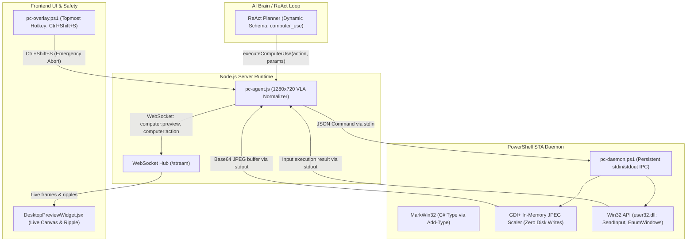

# Computer Use & Otomasi Desktop Win32

Dokumen ini menjelaskan subsistem **Computer Use & Windows PC Automation** pada sistem **MARK**, merinci arsitektur kendali visual Vision-Language-Action (VLA) berbasis kanvas kanonikal 1280x720, tangkapan layar JPEG in-memory berkecepatan tinggi, primitif masukan Win32 tingkat rendah, daemon persisten C#, preview HUD real-time, serta mekanisme keselamatan darurat (*Emergency Abort*).

---

## 1. Arsitektur Daemon Computer Use (Persistent Win32 Bridge)

Sebagian besar asisten AI di pasar tidak dapat berinteraksi langsung dengan aplikasi desktop Windows karena keterbatasan sandbox peramban atau lingkungan kontainer cloud.

MARK memecahkan masalah ini dengan memadukan dua kapabilitas terpadu:
1. **Visual Computer Use (Vision-Language-Action / VLA):** Pengamatan visual berbasis tangkapan layar beresolusi terstandarisasi 1280x720 dengan pemetaan koordinat ternormalisasi, didukung oleh primitif mouse dan keyboard native Windows.
2. **Structural UI Automation:** Inspeksi pohon elemen UIAutomation Windows untuk interaksi instan tanpa biaya vision API ketika elemen GUI standar tersedia.

### Komponen Utama:
- Server Tool Facade & Koordinat Engine: [`src/server/tools/pc-agent.js`](file:///d:/My%20Project/mark-project/mark/src/server/tools/pc-agent.js)
- Skrip Daemon PowerShell + C#: [`src/main/pc-agent-scripts/pc-daemon.ps1`](file:///d:/My%20Project/mark-project/mark/src/main/pc-agent-scripts/pc-daemon.ps1)
- Skrip Overlay Darurat: [`src/main/pc-agent-scripts/pc-overlay.ps1`](file:///d:/My%20Project/mark-project/mark/src/main/pc-agent-scripts/pc-overlay.ps1)
- Web Bridge & Native Tool Registry: [`src/main/tools/system-tools.js`](file:///d:/My%20Project/mark-project/mark/src/main/tools/system-tools.js) dan [`src/server/tools/group-tools.js`](file:///d:/My%20Project/mark-project/mark/src/server/tools/group-tools.js)
- Floating HUD Real-Time: [`src/renderer/src/components/DesktopPreviewWidget.jsx`](file:///d:/My%20Project/mark-project/mark/src/renderer/src/components/DesktopPreviewWidget.jsx)


```mermaid
flowchart TD
    subgraph "AI Brain / ReAct Loop"
        Planner["ReAct Planner (Dynamic Schema: computer_use)"]
    end

    subgraph "Node.js Server Runtime"
        CoordEngine["pc-agent.js (1280x720 VLA Normalizer)"]
        WSHub["WebSocket Hub (/stream)"]
    end

    subgraph "PowerShell STA Daemon"
        Daemon["pc-daemon.ps1 (Persistent stdin/stdout IPC)"]
        CSharp["MarkWin32 (C# Type via Add-Type)"]
        GDI["GDI+ In-Memory JPEG Scaler (Zero Disk Writes)"]
        Win32["Win32 API (user32.dll: SendInput, EnumWindows)"]
    end

    subgraph "Frontend UI & Safety"
        HUD["DesktopPreviewWidget.jsx (Live Canvas & Ripple)"]
        Overlay["pc-overlay.ps1 (Topmost Hotkey: Ctrl+Shift+S)"]
    end

    Planner -->|"executeComputerUse(action, params)"| CoordEngine
    CoordEngine -->|"JSON Command via stdin"| Daemon
    Daemon --> GDI
    Daemon --> Win32
    GDI -->|"Base64 JPEG buffer via stdout"| CoordEngine
    Win32 -->|"Input execution result via stdout"| CoordEngine
    CoordEngine -->|"WebSocket: computer:preview, computer:action"| WSHub
    WSHub -->|"Live frames & ripples"| HUD
    Overlay -->|"Ctrl+Shift+S (Emergency Abort)"| CoordEngine
```

---

## 2. Kanvas Kanonikal & Normalisasi Koordinat (1280x720 VLA)

Untuk memastikan konsistensi inferensi model visual pada berbagai resolusi fisik layar (seperti 1080p, 1440p, 4K, hingga DPI scaling 125%/150%), sistem menggunakan ruang koordinat kanonikal tetap:
- **Lebar Kanonikal ($W_{\text{canonical}}$):** `1280` piksel
- **Tinggi Kanonikal ($H_{\text{canonical}}$):** `720` piksel

### Rumus Denormalisasi:
Ketika model mengirim koordinat $(X_{\text{model}}, Y_{\text{model}})$ pada kanvas 1280x720, `pc-agent.js` mengonversinya ke koordinat fisik layar host $(X_{\text{host}}, Y_{\text{host}})$ menggunakan rasio dimensi fisik:

$$X_{\text{host}} = \mathrm{round}\left(X_{\text{model}} \times \frac{W_{\text{host}}}{1280}\right)$$

$$Y_{\text{host}} = \mathrm{round}\left(Y_{\text{model}} \times \frac{H_{\text{host}}}{720}\right)$$

Jika parameter `coordinate_space: "physical"` diberikan, koordinat dilewatkan langsung tanpa penskalaan.

---

## 3. Tangkapan Layar In-Memory GDI+ (Zero Disk I/O)

Tangkapan layar tradisional yang menulis berkas sementara ke SSD menimbulkan overhead latensi 150-300ms dan keausan media penyimpanan. Daemon `pc-daemon.ps1` mengimplementasikan fungsi `Capture-ScreenJpeg`:
1. Membaca Device Context layar primer melalui GDI+.
2. Melakukan *bicubic downsampling* langsung di memori ke dimensi 1280x720.
3. Mengompresi buffer bitmap ke format JPEG (kualitas 75%) menggunakan `System.IO.MemoryStream`.
4. Mengembalikan string Base64 murni ke `stdout` tanpa penulisan berkas fisik apapun.

Latensi tangkapan layar tercapai pada rentang **< 40ms**.

---

## 4. Primitif Masukan & Kontrak Tool `computer_use`

MARK menyediakan tool terpadu `computer_use` yang dirancang untuk otomasi aplikasi dan tugas desktop Windows:

### Aksi yang Didukung:

| Aksi | Parameter Utama | Deskripsi |
| :--- | :--- | :--- |
| `screenshot` | - | Mengambil citra JPEG kanonikal 1280x720 terbaru dalam format data URI Base64. |
| `click` | `coordinate: [x, y]`, `button` | Memindahkan kursor dan melakukan klik tunggal (default: `left`). |
| `double_click` | `coordinate: [x, y]` | Memindahkan kursor dan melakukan klik ganda dengan jeda 80ms. |
| `right_click` | `coordinate: [x, y]` | Memindahkan kursor dan memicu konteks menu klik kanan. |
| `middle_click` | `coordinate: [x, y]` | Klik tombol tengah mouse. |
| `mouse_down` | `coordinate: [x, y]`, `button` | Menahan tombol mouse pada posisi tertentu tanpa melepasnya. |
| `mouse_up` | `coordinate: [x, y]`, `button` | Melepaskan tombol mouse yang sedang ditahan. |
| `move` | `coordinate: [x, y]` | Memindahkan kursor mouse secara presisi ke koordinat target. |
| `drag` | `start_coordinate`, `end_coordinate`, `button` | Menahan mouse dari koordinat awal, menggeser bertahap, dan melepas di koordinat akhir. |
| `burst_click` | `coordinate: [x, y]`, `count`, `interval_ms` | Mengeksekusi rangkaian klik cepat berulang. |
| `type` | `text` | Mengetikkan teks UTF-16 menggunakan injeksi `SendInput` Unicode. |
| `key` | `key` | Menekan tombol tunggal (misalnya `Return`, `Escape`, `Tab`, `Back`). |
| `key_down` | `key` | Menahan tombol fisik tertentu pada keyboard. |
| `key_up` | `key` | Melepaskan tombol fisik keyboard yang sedang ditahan. |
| `hotkey` | `keys: ["ctrl", "shift", "p"]` | Menekan kombinasi tombol pintasan secara serentak dan melepasnya berurutan. |
| `scroll` | `coordinate`, `direction`, `amount` | Menggulirkan roda mouse vertikal (`up`/`down`) atau horizontal (`left`/`right`). |
| `wait` | `duration_ms` | Memberikan jeda waktu diam terkontrol sebelum aksi berikutnya. |
| `batch` | `actions: [...]` | Mengeksekusi rangkaian aksi di atas secara berurutan dalam satu giliran inferensi tunggal. |

### Contoh Pemanggilan Tool `computer_use`:
```json
{
  "action": "click",
  "coordinate": [640, 360],
  "button": "left"
}
```

---

## 5. Live HUD Desktop Preview (`DesktopPreviewWidget`)

Saat aksi Computer Use berlangsung, MARK memancarkan event WebSocket ke klien frontend:
- `computer:preview`: Menyiarkan frame JPEG 1280x720 terbaru untuk ditampilkan pada widget mengambang.
- `computer:click`: Menyiarkan koordinat klik untuk animasi riak gelombang visual (*click ripple effect*).
- `computer:action`: Memperbarui badge aksi yang sedang dieksekusi (misalnya `CLICK`, `DRAG`, `BURST_CLICK`).

Komponen [`DesktopPreviewWidget.jsx`](file:///d:/My%20Project/mark-project/mark/src/renderer/src/components/DesktopPreviewWidget.jsx) menyediakan:
- Layar miniatur interaktif dengan rasio 16:9.
- Indikator riak klik visual tepat pada koordinat kanonikal.
- Tombol darurat pemutus eksekusi langsung dari antarmuka.

---

## 6. Sistem Penghentian Darurat & Whitelist Keamanan

Interaksi fisik AI dengan OS diproteksi oleh lapisan keselamatan berlapis:

1. **Overlay Darurat Hardware (`Ctrl + Shift + S`):**
   - Jendela transparan topmost mendengarkan pintasan keyboard global `Ctrl + Shift + S`.
   - Menekan pintasan ini segera membunuh proses daemon PC dan memancarkan sinyal `ai:abort` ke seluruh ekosistem agent.
2. **Penyaringan Kombinasi Tombol Berbahaya:**
   - [`src/main/tools/system-tools.js`](file:///d:/My%20Project/mark-project/mark/src/main/tools/system-tools.js) memblokir kombinasi tombol berisiko tinggi seperti `Ctrl+Alt+Del`, penguncian layar (`Win+L`), atau perintah format disk tanpa persetujuan eksplisit pengguna.
3. **Dukungan Tool Win32 Bawaan (`os-*`):**
   - Seluruh tool turunan `os-*` (`os-read`, `os-click`, `os-type`, `os-key`, `os-scroll`, `os-open`, `os-list-windows`, `os-focus-window`) terintegrasi langsung di dalam kelompok alat `computer_use`.
