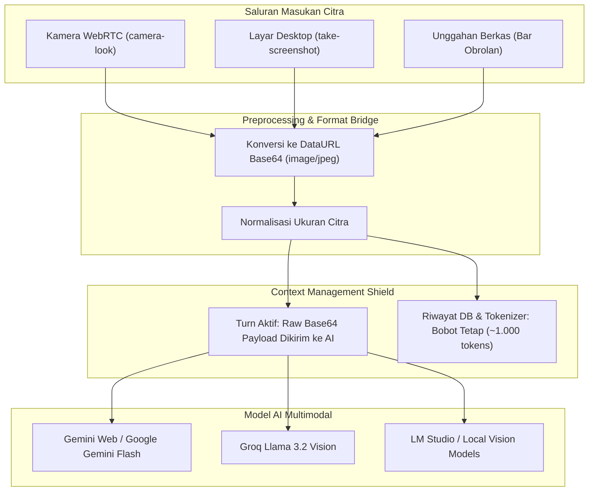

# Penglihatan Mesin, Tangkapan Layar & Integrasi Kamera

Dokumen ini menjelaskan kapabilitas **Multimodal Vision** pada sistem **MARK**, merinci alur penangkapan citra dari kamera WebRTC, analisis layar desktop Windows penuh (_Screen Vision_), pengunggahan gambar lampiran, serta teknik normalisasi konteks (_Context Normalization_) untuk mencegah lonjakan token.

---

## 1. Arsitektur Vision Multimodal MARK

MARK dirancang untuk memahami dunia nyata dan antarmuka perangkat lunak tidak hanya dari teks, tetapi juga melalui data visual. MARK mendukung tiga saluran masukan citra:

1. **Kamera Fisik (WebRTC / Webcam):** Agen dapat meminta satu bingkai foto dari kamera pengguna melalui alat `camera-look`.
2. **Tangkapan Layar Desktop (Screen Vision):** Agen dapat memotret jendela atau layar penuh Windows via alat `take-screenshot`.
3. **Lampiran Berkas Gambar:** Pengguna dapat mengunggah berkas gambar langsung ke bar obrolan (`.png`, `.jpg`, `.jpeg`, `.webp`, `.gif`, `.bmp`).



---

## 2. Integrasi Kamera WebRTC (`camera-look`)

Ketika pengguna meminta MARK melihat sesuatu di dunia nyata (contoh: _"Lihat barang yang kupegang ini, apa mereknya?"_):

1. Agen memanggil alat `camera-look`.
2. Hook [`src/renderer/src/hooks/useMarkAgent.js`](file:///d:/My%20Project/mark-project/mark/src/renderer/src/hooks/useMarkAgent.js) meneruskan permintaan ke `requestCameraCaptureRef`.
3. Komponen kamera di `MarkHome.jsx` mengaktifkan stream WebRTC, mengambil frame tunggal dengan resolusi seimbang, dan mengembalikannya dalam format string Base64 JPEG.
4. Engine ReAct menyusun pesan multimodal dan mengirimkannya ke penyedia AI:
   ```json
   {
     "role": "user",
     "content": [
       { "type": "text", "text": "Analisis apa yang terlihat pada tangkapan kamera ini." },
       { "type": "image_url", "image_url": { "url": "data:image/jpeg;base64,..." } }
     ]
   }
   ```
5. Hasil analisis teks dikembalikan sebagai observasi bagi loop ReAct.

---

## 3. Tangkapan Layar Desktop Windows (`take-screenshot`)

Untuk memahami tampilan aplikasi pihak ketiga yang tidak memiliki API teks:

- MARK memanggil modul PowerShell/Win32 untuk menangkap bitmap layar penuh desktop.
- Citra dikonversi menjadi berkas JPEG di direktori cache sementara `~/.config/mark-agent/screenshots/`.
- Gambar diumpankan ke model vision untuk mendeteksi error dialog, tata letak UI, atau pesan peringatan sistem secara instan.

---

## 4. Normalisasi Konteks Gambar (Mencegah Ledakan Token)

String citra Base64 berukuran rata-rata antara 500 KB hingga 3 MB (setara puluhan hingga ratusan ribu token jika dibiarkan dalam riwayat percakapan teks mentah). Jika 5 gambar terkumpul dalam satu sesi, jendela konteks akan langsung penuh (_context window blowout_).

MARK menerapkan teknik **Normalisasi Konteks Token & Format Riwayat** di [`src/renderer/src/api/ai/contextManager.js`](file:///d:/My%20Project/mark-project/mark/src/renderer/src/api/ai/contextManager.js):

1. **Pada Turn Aktif:** Citra Base64 utuh dikirimkan ke model vision untuk mendapatkan inferensi visual akurat.
2. **Normalisasi Token Per-Citra:** Pada penghitungan konteks via `calculateMessageTokens()`, representasi base64 citra dinormalisasi menjadi bobot tetap **~1.000 tokens** per gambar, memastikan kuota jendela 256K tokens tetap stabil dan tidak terdistorsi oleh ukuran byte base64:
   ```javascript
   // Cuplikan dari calculateMessageTokens di src/renderer/src/api/ai/contextManager.js
   if (msg.content.includes('data:image/')) {
     const normalized = msg.content.replace(/data:image\/[a-zA-Z0-9+]+;base64,[A-Za-z0-9+/=]+/g, '')
     total += countTokens(normalized) + 1000
   }
   ```
3. **Penyusutan String Riwayat:** String Base64 pada riwayat dipangkas (maksimal 2.000 karakter) agar tidak membebani payload IPC dan serialisasi database:
   ```javascript
   if (part.type === 'image_url') {
     const urlStr = part.image_url?.url || ''
     const truncated =
       urlStr.length > 2000 ? urlStr.slice(0, 2000) + '...[GAMBAR DIPANGKAS]' : urlStr
     return { type: 'image_url', image_url: { url: truncated } }
   }
   ```
4. **Persistensi File Fisik:** Berkas fisik gambar tetap tersimpan di disk atau cache lokal sehingga antarmuka pengguna dapat menampilkannya kembali kapan saja tanpa membebani memori inferensi LLM.
