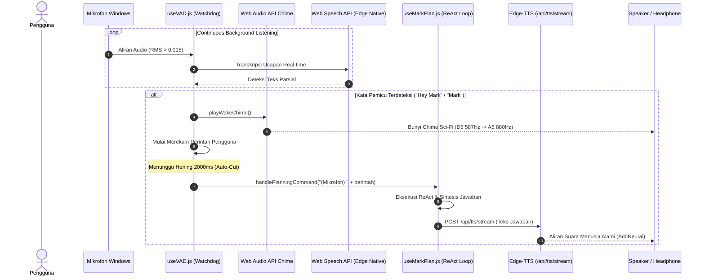

# Pipeline Suara & Pemrosesan Audio Real-time

Dokumen ini menjelaskan arsitektur **Voice & Audio Pipeline** pada sistem **MARK**, merinci pengenalan ucapan nir-dependensi via Web Speech API, deteksi kata pemicu (_Wake Word Watchdog_), sintesis nada konfirmasi Web Audio API, Voice Activity Detection (VAD), serta Text-to-Speech (TTS) berbasis Microsoft Edge Neural TTS.

---

## 1. Filosofi Desain Audio: Kecepatan & Kemandirian Lokal

Banyak asisten suara modern bergantung pada transmisi audio streaming penuh ke server cloud pihak ketiga (seperti OpenAI Realtime API atau ElevenLabs). Pendekatan ini menimbulkan latensi tinggi (1-3 detik), biaya komputasi besar, dan risiko privasi kebocoran rekaman suara harian pengguna.

MARK menerapkan arsitektur suara hibrida:

1. **Zero-Dependency STT (Speech-to-Text):** Menggunakan native Web Speech API (`SpeechRecognition` / `webkitSpeechRecognition`) yang telah terintegrasi di dalam engine Chromium Microsoft Edge.
2. **Local Chime & Watchdog:** Pemicuan kata bangun ("Hey Mark" / "Mark") dievaluasi secara lokal tanpa latensi jaringan.
3. **Edge Neural TTS:** Sintesis suara menggunakan stream audio dari `msedge-tts` (suara alami `id-ID-ArdiNeural` / `id-ID-GadisNeural`) dengan latency _time-to-first-byte_ di bawah 300ms.



---

## 2. Deteksi Kata Pemicu (Wake Word Watchdog)

Implementasi deteksi suara latar belakang terletak pada:

- [`src/renderer/src/hooks/useVAD.js`](file:///d:/My%20Project/mark-project/mark/src/renderer/src/hooks/useVAD.js)
- [`src/renderer/src/api/wakeWord.js`](file:///d:/My%20Project/mark-project/mark/src/renderer/src/api/wakeWord.js)
- [`src/renderer/src/api/webSpeech.js`](file:///d:/My%20Project/mark-project/mark/src/renderer/src/api/webSpeech.js)

### Pemicu Bawaan:

- _"Hey Mark"_, _"Hai Mark"_, _"Mark"_
- Pemicu kustom yang dapat dikonfigurasi melalui menu Settings pada basis data SQLite `config`.

### Pembersihan Perintah Lisan (`cleanSpokenCommand`):

Ketika pengguna mengucapkan _"Hey Mark, buka aplikasi VS Code"_, fungsi parser secara otomatis memangkas kata pemicu dan menyisakan perintah inti: _"buka aplikasi VS Code"_.

---

## 3. Chime Audio Sintesis Murni (`playWakeChime`)

Untuk memberikan konfirmasi instan bahwa MARK telah mendengar dan siap menerima perintah, MARK memutar nada konfirmasi sci-fi lembut ("tutt-ting") menggunakan Web Audio API tanpa memerlukan aset berkas `.mp3` atau `.wav` eksternal:

```javascript
// src/renderer/src/hooks/useVAD.js
// Nada 1: D5 (587.33 Hz)
const osc1 = ctx.createOscillator()
osc1.frequency.setValueAtTime(587.33, now)
// Nada 2: A5 (880.00 Hz)
const osc2 = ctx.createOscillator()
osc2.frequency.setValueAtTime(880.0, now + 0.08)
```

Pendekatan ini menjamin suara chime berbunyi dalam 0ms tanpa kemungkinan gagal akibat berkas media belum terunduh.

---

## 4. Voice Activity Detection (VAD) & Parameter Sensitivitas

Hook `useVAD.js` mengatur lifecycle mikrofon dengan konfigurasi:

- **Speech Threshold:** Sensitivitas volume input `RMS > 0.015`. Di bawah ambang batas ini, suara dianggap sebagai desah angin atau noise ruangan.
- **Auto-Cut Silence Timeout:** `2000 ms`. Jika pengguna berhenti berbicara selama 2 detik, sistem menganggap perintah selesai dan langsung mengirim teks ke ReAct loop.
- **Continuous Restart Watchdog:** Jika koneksi Web Speech terputus oleh peramban, watchdog internal secara otomatis merestart engine dalam jeda 300ms.

---

## 5. Sintesis Suara Microsoft Edge Neural TTS

MARK memanfaatkan API Edge Neural TTS yang terkenal sangat ekspresif dan natural untuk bahasa Indonesia dan Inggris:

Implementasi:

- Backend Service: [`src/server/tools/media-tools.js`](file:///d:/My%20Project/mark-project/mark/src/server/tools/media-tools.js)
- Client Audio Queue: [`src/renderer/src/api/ai/utils.js`](file:///d:/My%20Project/mark-project/mark/src/renderer/src/api/ai/utils.js)

### Monkey Patch Pencegah Crash Node.js:

Library open-source `msedge-tts` rentan memicu `UnhandledPromiseRejection` jika stream audio diputus mendadak di tengah kalimat. MARK mem-patch prototype `MsEdgeTTS` di `media-tools.js`:

```javascript
// Menghindari unhandled rejection saat koneksi websocket ditutup paksa
MsEdgeTTS.prototype._pushAudioData = function (data, requestId) {
  if (this._streams && this._streams[requestId] && this._streams[requestId].audio) {
    try {
      if (!this._streams[requestId].audio.destroyed) {
        this._streams[requestId].audio.push(data)
      }
    } catch (_) {}
  }
}
```

### Antrean Suara Cerdas (`speechQueue`):

- Kalimat dipotong berdasarkan tanda baca (`.`, `!`, `?`, `\n`) sehingga audio kalimat pertama dapat langsung diputar ke speaker saat kalimat berikutnya masih dalam proses sintesis (_pipelined playback_).
- Jika pengguna berbicara kembali atau menekan tombol Stop, `speechQueue.reset()` seketika mematikan audio yang sedang diputar tanpa dengung sisa.
