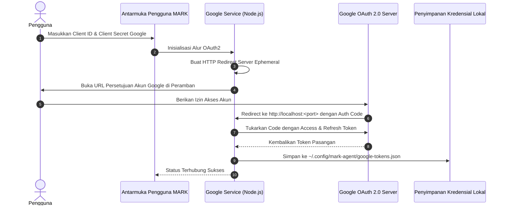

# Integrasi Google Workspace (Gmail, Calendar, Drive)

Dokumen ini menjelaskan arsitektur integrasi **Google Workspace** pada sistem **MARK**, merinci alur autentikasi OAuth2 lokal, penanganan siklus penyegaran token (_Token Refresh Lifecycle_), serta kapabilitas pembacaan dan penulisan pada Google Calendar, Gmail, dan Google Drive.

---

## 1. Arsitektur Integrasi Google

MARK menyediakan jembatan native ke ekosistem produktivitas Google tanpa memerlukan layanan perantara cloud pihak ketiga (_No Third-Party Middleman_). Seluruh token disimpan dan didekripsi langsung di komputer pengguna.

Implementasi:

- Layanan OAuth2: [`src/main/google/google-service.js`](file:///d:/My%20Project/mark-project/mark/src/main/google/google-service.js)
- Implementasi Alat Native: [`src/main/tools/google-tools.js`](file:///d:/My%20Project/mark-project/mark/src/main/tools/google-tools.js)



---

## 2. Cakupan Akses (OAuth Scopes)

MARK meminta cakupan akses yang disesuaikan secara presisi untuk produktivitas harian:

- `https://www.googleapis.com/auth/drive`: Membaca struktur berkas dan mengunduh dokumen Google Drive.
- `https://www.googleapis.com/auth/calendar`: Membaca jadwal agenda harian dan membuat pertemuan baru di Google Calendar.
- `https://www.googleapis.com/auth/gmail.modify`: Mencari pesan masuk, membaca utas email penting, dan mengirim balasan email via Gmail.

---

## 3. Penyimpanan Token & Penyegaran Otomatis (Token Refresh)

Token autentikasi disimpan di:

```
C:\Users\<Username>\.config\mark-agent\google-tokens.json
```

Ketika masa berlaku `access_token` berakhir (biasanya setelah 60 menit), fungsi `getAuthClient` mendengarkan event token:

```javascript
// src/main/google/google-service.js
oAuth2Client.on('tokens', async (newTokens) => {
  const currentTokens = (await getTokens()) || {}
  if (newTokens.refresh_token) {
    currentTokens.refresh_token = newTokens.refresh_token
  }
  currentTokens.access_token = newTokens.access_token
  await saveTokens(currentTokens)
})
```

Proses ini berjalan di latar belakang secara transparan, sehingga pengguna tidak perlu melakukan login ulang secara manual.

---

## 4. Alat Google yang Tersedia untuk Agen

Di dalam loop ReAct, MARK dapat memanggil kelompok alat Google saat kelompok `google_workspace` dimuat:

1. **Google Calendar:**
   - `google-calendar-list`: Mengambil daftar agenda atau jadwal rapat berdasarkan rentang tanggal.
   - `google-calendar-create`: Membuat jadwal acara baru lengkap dengan judul, deskripsi, waktu mulai, dan pengingat.
2. **Gmail:**
   - `gmail-search`: Mencari email masuk berdasarkan kata kunci, pengirim, atau label.
   - `gmail-read`: Membaca isi teks dan lampiran utas email tertentu.
   - `gmail-send`: Mengirim email baru atau membalas pesan.
3. **Google Drive:**
   - `google-drive-search`: Mencari dokumen atau folder di akun Google Drive.
   - `google-drive-download`: Mengunduh berkas Google Drive ke workspace lokal pengguna.
