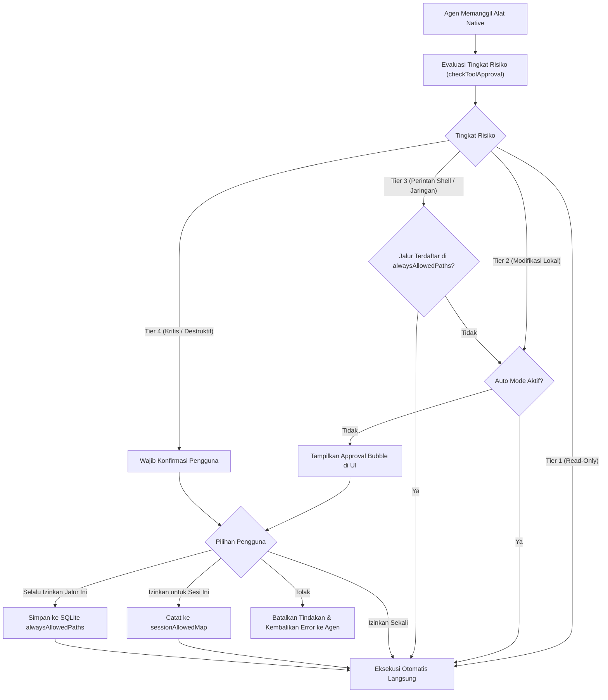

# Model Keamanan, Persetujuan & Auto Mode (YOLO)

Dokumen ini menjelaskan arsitektur keamanan, model persetujuan 4 tingkat (_4-Tier Security Matrix_), mekanisme eksekusi otonom (_Auto Mode / YOLO Mode_), filter sanitasi perintah berbahaya, serta sistem izin jalur permanen (_Always Allowed Paths_) pada sistem **MARK**.

---

## 1. Filosofi Keamanan: Keseimbangan Kontrol & Otonomi

Sebagai agen AI yang memiliki akses tingkat rendah ke shell Windows dan sistem berkas lokal, MARK dirancang dengan prinsip pertahanan berlapis (_defense-in-depth_). Pengguna memiliki kendali penuh atas batas tindakan yang boleh dilakukan oleh agen di komputer mereka.

Implementasi gerbang keamanan dikelola di:

- [`src/renderer/src/contexts/ApprovalContext.jsx`](file:///d:/My%20Project/mark-project/mark/src/renderer/src/contexts/ApprovalContext.jsx)
- [`src/main/tools/system-tools.js`](file:///d:/My%20Project/mark-project/mark/src/main/tools/system-tools.js)
- [`src/renderer/src/components/Chat/ApprovalBubble.jsx`](file:///d:/My%20Project/mark-project/mark/src/renderer/src/components/Chat/ApprovalBubble.jsx)

---

## 2. Matriks Keamanan 4 Tingkat (4-Tier Security Matrix)

Setiap alat native diklasifikasikan ke dalam salah satu dari empat kategori risiko:

| Tingkat    | Definisi Risiko                | Contoh Alat                                                      | Kebijakan Manual      | Kebijakan Auto Mode                   |
| :--------- | :----------------------------- | :--------------------------------------------------------------- | :-------------------- | :------------------------------------ |
| **Tier 1** | **Aman / Baca-Saja**           | `read-file`, `list-directory`, `system-info`, `search-files`     | Eksekusi Langsung     | Eksekusi Langsung                     |
| **Tier 2** | **Modifikasi Lokal Aman**      | `write-file`, `replace-content`, `browser-click`, `browser-type` | Meminta Persetujuan   | **Otomatis Dieksekusi**               |
| **Tier 3** | **Perintah Eksternal & Shell** | `run-powershell`, `git-commit`, `send-telegram`                  | Meminta Persetujuan   | **Otomatis (Kecuali jika berbahaya)** |
| **Tier 4** | **Kritis / Destruktif**        | `delete-file`, format disk, modifikasi registry Windows          | **Wajib Persetujuan** | **Tetap Wajib Persetujuan**           |

---

## 3. Auto Mode (YOLO Mode) & Resolusi In-Memory 0ms

Untuk tugas pengembangan perangkat lunak yang intensif di mana agen perlu membuat puluhan berkas dan menjalankan tes unit berturut-turut, meminta konfirmasi pada setiap tindakan akan memperlambat alur kerja.

Pengguna dapat mengaktifkan **Auto Mode** pada sesi tertentu melalui tombol toggle di bar obrolan:

### Karakteristik Teknis Auto Mode MARK:

1. **Per-Session Isolation:** Auto Mode diatur per ID sesi obrolan (`is_auto_mode` pada tabel `sessions` di SQLite). Sesi A dapat berjalan dalam mode Auto penuh, sementara sesi B tetap dalam mode manual yang ketat.
2. **Dual-Field Persistence:** Nilai mode disinkronkan secara konsisten pada field snake_case (`is_auto_mode`) dan camelCase (`isAutoMode`) di database untuk menjaga integritas skema REST.
3. **Resolusi In-Memory 0ms:** Menggunakan `autoModeSessionsRef` di `ApprovalContext.jsx` sehingga evaluasi izin bernilai instan tanpa overhead query jaringan REST berulang.
4. **Auto-Resolve Pending Approvals:** Jika pengguna mengaktifkan Auto Mode saat sebuah dialog persetujuan sedang mengambang di layar (_in-flight approval_), sistem secara otomatis menyetujui dialog tertunda tersebut seketika dan melanjutkan eksekusi loop ReAct tanpa perlu klik manual tambahan.
5. **Perlindungan Terhadap Perintah Kritis:** Sekalipun Auto Mode aktif, perintah yang masuk kategori **Tier 4** atau yang terdeteksi oleh filter `isDangerousCommand` tetap akan menahan eksekusi dan memunculkan dialog persetujuan merah.

---

## 4. Opsi Persetujuan Lanjutan

Ketika dialog persetujuan muncul di antarmuka pengguna (`ApprovalBubble.jsx`), pengguna memiliki empat pilihan tindakan:

1. **Izinkan Sekali (_Approve Once_):** Menyetujui satu pemanggilan alat saat ini saja.
2. **Izinkan untuk Sesi Ini (_Approve for Session_):** Menambahkan perintah atau target jalur berkas ke dalam memori sesi aktif (`sessionAllowedMapRef`). Selama sesi tersebut belum ditutup, perintah serupa tidak akan meminta izin lagi.
3. **Selalu Izinkan Jalur Ini (_Approve Always_):**
   - Menormalisasi target perintah atau folder proyek (contoh: `d:/project/my-app/`).
   - Menyimpan target tersebut secara permanen ke dalam tabel `config` SQLite di kolom `alwaysAllowedPaths`.
   - Di masa mendatang, seluruh operasi pada direktori tersebut akan dieksekusi secara otomatis pada semua sesi obrolan.
4. **Tolak (_Deny_):** Menghentikan eksekusi alat dan mengembalikan pesan observasi khusus ke agen: `"[DITOLAK] User menolak eksekusi alat ini. Cari cara lain atau tanyakan detail ke pengguna."`

---

## 5. Filter Sanitasi Perintah Berbahaya (`isDangerousCommand`)

Di [`src/main/tools/system-tools.js`](file:///d:/My%20Project/mark-project/mark/src/main/tools/system-tools.js), MARK menerapkan regex validator terhadap setiap perintah shell sebelum dieksekusi:

Pola yang dicegah meliputi:

- Perintah penghapusan direktori akar (`rmdir /s /q C:\`, `Remove-Item -Recurse C:\`).
- Pemformatan partisi atau volume drive (`Format-Volume`, `diskpart`).
- Modifikasi kredensial sistem dan registry akun pengguna (`reg delete HKLM\SAM`).
- Eksekusi skrip remote anonim yang tidak terverifikasi melalui pipe (`Invoke-Expression (New-Object Net.WebClient)...`).

Perintah yang cocok dengan pola tersebut akan langsung ditolak di tingkat server sebelum mencapai shell Windows.

---

## 6. Keamanan Jaringan & Local Loopback Binding (CORS & Host Binding)

Untuk melindungi komputer pengguna dari serangan lintas situs (*Cross-Site Request Forgery* / CSRF dan DNS rebinding) saat menjelajah web di peramban eksternal:

1. **Strict Local Loopback (`127.0.0.1`):** Secara default, server Node.js MARK mengikat soket HTTP secara eksklusif ke `127.0.0.1` (bukan wildcard `0.0.0.0`). Tindakan ini mencegah perangkat lain di jaringan Wi-Fi/LAN lokal mengakses daemon kontrol PC atau API REST MARK. Binding dapat disesuaikan menggunakan variabel lingkungan `HOST` bila diperlukan secara sengaja.
2. **Whitelist CORS Ketat:** Middleware Express menerapkan filter asal (*origin*) yang membatasi akses lintas domain hanya untuk klien lokal (`http://localhost:*` dan `http://127.0.0.1:*`) serta permintaan tanpa origin (seperti Microsoft Edge App Mode, CLI launcher, dan bot Telegram). Permintaan lintas domain dari situs web publik manapun di peramban standar otomatis ditolak oleh server.

