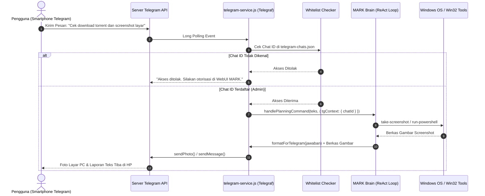

# Integrasi Telegram Bot & Akses Jarak Jauh (Remote Control)

Dokumen ini menjelaskan arsitektur **Telegram Bot Engine** pada sistem **MARK**, merinci alur autentikasi admin jarak jauh, penanganan pesan dua arah (_Bi-directional Bridge_), eksekusi tindakan PC dari luar rumah, penangkapan cuplikan layar instan, serta pemformatan teks Markdown Telegram.

---

## 1. Arsitektur Jembatan Telegram (Telegraf Bridge)

MARK bukan hanya asisten yang dapat digunakan saat pengguna duduk di depan komputer. Melalui modul Telegram Bot bawaan, pengguna dapat berinteraksi dan memerintahkan komputernya dari jarak jauh (misalnya melalui smartphone saat sedang bepergian).

Implementasi backend:

- Berkas Utama: [`src/main/telegram/telegram-service.js`](file:///d:/My%20Project/mark-project/mark/src/main/telegram/telegram-service.js)
- Router Integrasi: [`src/server/routes/integrations.routes.js`](file:///d:/My%20Project/mark-project/mark/src/server/routes/integrations.routes.js)
- Formatter Respons: [`src/renderer/src/api/ai/utils.js`](file:///d:/My%20Project/mark-project/mark/src/renderer/src/api/ai/utils.js)



---

## 2. Alur Otorisasi Admin & Whitelist Keamanan

Untuk mencegah pihak asing mengakses komputer pengguna melalui bot publik Telegram:

1. Token bot (`botToken`) disimpan terenkripsi di tabel konfigurasi SQLite.
2. Saat bot pertama kali dijalankan, bot hanya menerima koneksi dari ID percakapan (_Chat ID_) yang terdaftar di berkas lokal:
   ```
   C:\Users\<Username>\.config\mark-agent\telegram-chats.json
   ```
3. Pengguna baru yang mengirim pesan ke bot akan menerima pesan penolakan dan permintaan verifikasi admin. Pengguna dapat menyetujui akun Telegram tersebut secara langsung melalui panel Settings di antarmuka WebUI MARK.

---

## 3. Kapabilitas Jarak Jauh (Remote PC Actions)

Melalui obrolan Telegram, pengguna dapat memicu berbagai kapabilitas tingkat sistem operasi:

- **Tangkapan Layar Instan (`/screenshot`):** Memotret layar desktop Windows secara diam-diam dan mengirimkan berkas fotonya langsung ke Telegram.
- **Pemeriksaan Status Sistem:** Mengecek beban penggunaan CPU, RAM, suhu, dan proses yang sedang aktif di komputer.
- **Eksekusi Tugas Jarak Jauh:** Menugaskan sub-agen untuk melakukan riset web, mengunduh file, atau memodifikasi dokumen saat pengguna tidak berada di meja kerja.
- **Penghentian Darurat (`/abort` atau `/stop`):** Mematikan seluruh proses AI atau script latar belakang yang sedang berjalan di komputer.

---

## 4. Pemformatan Teks Khusus Telegram (`formatForTelegram`)

Format Markdown standar yang dihasilkan oleh model LLM (seperti tag `<think>`, blok kode bersarang, atau tabel HTML) sering kali rusak atau memicu error sintaksis jika dikirim langsung ke Telegram Bot API.

MARK menerapkan pembersihan otomatis melalui fungsi `formatForTelegram`:

- Memotong dan menyembunyikan blok penalaran internal `<think>...</think>`.
- Mengonversi format tautan dan formatting tebal/miring ke standar MarkdownV2 atau HTML Telegram yang valid.
- Memecah pesan panjang secara cerdas jika melebihi batas 4.096 karakter batas pesan tunggal Telegram.
