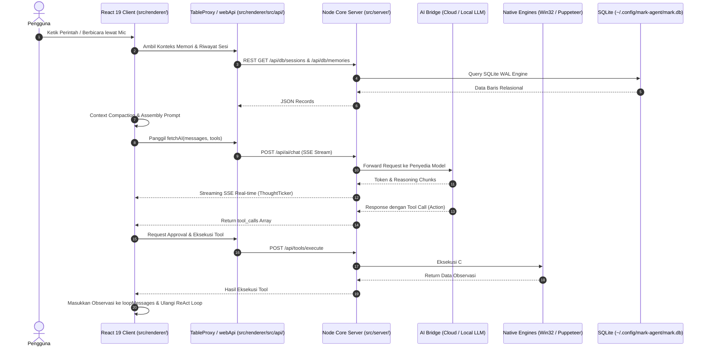

# Panduan Penelusuran Kode (Codebase Walkthrough)

Dokumen ini memandu pengembang dalam memahami anatomi repositori **MARK**, peta ketergantungan modul (_Module Dependency Graph_), alur data menyeluruh (_End-to-End Data Flow_), serta aturan teknis (_Code Invariants_) yang wajib dipatuhi saat mengembangkan fitur baru.

---

## 1. Taksonomi Struktur Repositori

Repositori MARK terbagi menjadi empat lapisan arsitektur utama:

```text
mark/
├── bin/
│   └── mark.js                      # CLI Entrypoint & Bootstrapper Launcher
├── src/
│   ├── cli/                         # Dasbor monitor status terminal real-time
│   │   └── monitor.js
│   ├── server/                      # Node.js Core Server (Express 4 + WebSocket Hub)
│   │   ├── index.js                 # Server bootstrapper & dynamic port listener
│   │   ├── launcher.js              # Edge App Mode browser launcher
│   │   ├── ws-hub.js                # WebSocket Hub (/stream)
│   │   ├── memory/                  # SQLite db-store.js, Orama WASM, Vector Engine
│   │   ├── routes/                  # Modular REST routers (index.js, chat, tasks, dll)
│   │   ├── services/                # ai-bridge.js (fetchAI) & gemini-web.js
│   │   └── tools/                   # pc-agent.js, media-tools.js, group-tools.js
│   ├── main/                        # Native Automation & Subsystem Services
│   │   ├── browser-agent.js         # Multi-session Puppeteer Core Chromium engine
│   │   ├── node-tools.js            # Facade re-export registry
│   │   ├── pc-agent-scripts/        # C# Win32 daemon (pc-daemon.ps1) & abort overlay
│   │   ├── task-daemon.js           # CLI background task manager
│   │   ├── git-service.js           # Git status, diff, commit, revert
│   │   ├── google/                  # Google OAuth2, Gmail, Calendar, Drive services
│   │   ├── telegram/                # Telegraf bot engine & polling service
│   │   └── tools/                   # file, browser, system, git, task, media tools
│   └── renderer/                    # Modern WebUI Client (React 19 / Vite 7)
│       └── src/
│           ├── api/                 # Transparent db.js, vectorMemory, contextManager, subagent/
│           ├── contexts/            # ApprovalContext, YoutubeMusicContext, TaskWorkflowContext
│           ├── hooks/               # useMarkAgent, useVAD, useAwareness, hooks/agent/ (useMarkPlan)
│           ├── components/          # ChatList, ThoughtTicker, BrowserPreviewWidget, subagent/
│           └── pages/               # MarkHome, ChatStudio, Subagents (Mission Control), Settings
└── docs/                            # Dokumentasi teknis komprehensif sistem MARK
```

---

## 2. Diagram Alur Data Menyeluruh (End-to-End Flow)



---

## 3. Invarian Arsitektur Wajib (Critical Design Invariants)

Bagi kontributor yang ingin menulis atau memodifikasi kode di repositori ini, ada aturan fundamental yang **tidak boleh dilanggar**:

### A. Strict Zero Emoji Rule

Dilarang keras menggunakan emoji apapun di dalam kode sumber, UI tampilan antarmuka, respon obrolan agen, pesan commit git, maupun berkas dokumentasi.

### B. Pemisahan Total Lapisan (_Strict Decoupling_)

Kode di dalam direktori `src/renderer/` berjalan di lingkungan peramban Web. **Dilarang keras** mengimpor modul native Node.js (`fs`, `path`, `child_process`, `crypto`, `os`) langsung di dalam `src/renderer/`. Seluruh operasi IO wajib melewati `webApi` atau `TableProxy` yang berkomunikasi ke `src/server/`.

### C. Basis Data Terpusat Tunggal (Single Source of Truth)

Seluruh penyimpanan data percakapan, tugas, memori, sub-agen, dan konfigurasi wajib menggunakan SQLite terpusat di `~/.config/mark-agent/mark.db`. Hindari membuat berkas penyimpanan JSON kustom terpisah kecuali untuk token kredensial sementara.

### D. Penanganan Kolom Skema SQLite

Dalam memanggil `SqliteTable.insert()` atau `SqliteTable.update()`, pastikan nama properti kolom mempertahankan format `snake_case` (seperti `is_auto_mode`, `created_at`, `parent_session_id`) agar tidak tertimpa oleh alias camelCase dinamis.
