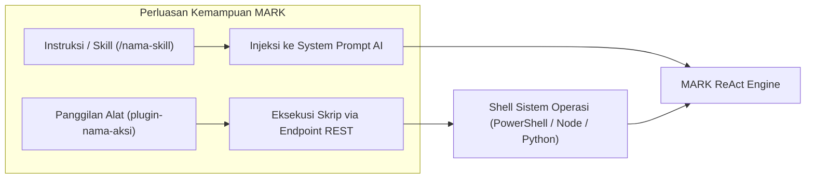

# Panduan Pembuatan Skills & Plugin Kustom

Dokumen ini memandu pengembang dalam memperluas kapabilitas sistem **MARK**, mencakup penyusunan dokumen keahlian (_Learned Skills_), sintesis keahlian otomatis (_Autonomous Skill Synthesis_), serta pembuatan plugin eksternal (_External Plugins_) dengan skema OpenAPI kustom.

---

## 1. Dua Pola Ekstensi di MARK

MARK menyediakan dua cara berbeda untuk memperluas kemampuannya:

| Pola Ekstensi           | Sasaran                                                                     | Mekanisme Eksekusi                                                        | Lokasi Penyimpanan                                  |
| :---------------------- | :-------------------------------------------------------------------------- | :------------------------------------------------------------------------ | :-------------------------------------------------- |
| **Skills (`SKILL.md`)** | Prosedur kerja bertahap, panduan perilaku, dan instruksi domain spesifik    | Diinjeksi langsung ke System Prompt saat dipicu                           | Direktori `skills/` & tabel SQLite `learned_skills` |
| **Plugins**             | Integrasi biner eksternal, CLI pihak ketiga, skrip Python/PowerShell kustom | Dieksekusi melalui sub-proses shell terisolasi via `/api/plugins/execute` | `~/.config/mark-agent/plugins/<nama>/`              |



---

## 2. Struktur Berkas Keahlian (`SKILL.md`)

Setiap keahlian didefinisikan dalam berkas Markdown dengan struktur metadata frontmatter YAML:

```markdown
---
name: verifikasi-kode-react
description: Prosedur pengujian dan pembersihan komponen React sebelum build produksi.
tools:
  - read-file
  - run-powershell
---

# Panduan Verifikasi Kode React

Ketika pengguna meminta verifikasi kode React, lakukan langkah-langkah berikut secara berurutan:

1. **Pemeriksaan Linter:** Jalankan `npm run lint` menggunakan tool `run-powershell`.
2. **Analisis Error:** Jika ada error ESLint, buka berkas terkait menggunakan `read-file` dan perbaiki baris yang bermasalah menggunakan `replace-content`.
3. **Validasi Build:** Jalankan `npm run build:ui` untuk memastikan bundler Vite tidak menghasilkan error kompilasi.
4. **Laporan:** Berikan ringkasan berkas yang diperbaiki kepada pengguna.
```

### Pemanggilan Skill:

Pengguna dapat memicu skill dengan mengetikkan garis miring (_slash command_) di obrolan:

```text
/verifikasi-kode-react tolong periksa komponen ChatList.jsx
```

MARK akan membaca isi berkas skill tersebut via `window.api.readSkill()` dan menyuntikkannya sebagai instruksi sistem prioritas tinggi.

---

## 3. Sintesis Keahlian Otonom (Autonomous Skill Synthesis)

MARK memiliki kemampuan belajar mandiri (_Continuous Cognitive Learning_):

- Setiap kali MARK berhasil menyelesaikan tugas kompleks multi-langkah (misalnya men-debug bug baru atau mengonfigurasi database), modul [`src/renderer/src/api/ai/skillSynthesizer.js`](file:///d:/My%20Project/mark-project/mark/src/renderer/src/api/ai/skillSynthesizer.js) secara otomatis mengevaluasi riwayat aksi yang berhasil.
- Sistem menyintesis prosedur teruji tersebut menjadi entitas keahlian baru.
- Keahlian disimpan ke dalam tabel SQLite `learned_skills` dan dapat dipanggil kembali di masa depan jika MARK menghadapi masalah serupa.

---

## 4. Pembuatan Plugin Eksternal (Custom Plugins)

Plugin eksternal memungkinkan pengembang menambahkan fungsi baru tanpa mengubah berkas inti server MARK.

### Struktur Direktori Plugin:

```text
~/.config/mark-agent/plugins/system-battery/
├── manifest.json
└── get-battery.ps1
```

### A. Berkas `manifest.json`

```json
{
  "name": "system-battery",
  "version": "1.0.0",
  "description": "Plugin pembaca status baterai laptop Windows tingkat lanjut.",
  "isEnabled": true,
  "actions": [
    {
      "name": "status",
      "description": "Mengambil persentase sisa baterai, status charging, dan estimasi waktu.",
      "triggerHint": "cek sisa baterai laptop",
      "command": "powershell.exe",
      "args": ["-NoProfile", "-ExecutionPolicy", "Bypass", "-File", "get-battery.ps1"]
    }
  ]
}
```

### B. Berkas Skrip Eksekusi (`get-battery.ps1`)

```powershell
$battery = Get-CimInstance -ClassName Win32_Battery
[PSCustomObject]@{
    Status = $battery.Status
    EstimatedChargeRemaining = "$($battery.EstimatedChargeRemaining)%"
    BatteryStatus = switch ($battery.BatteryStatus) {
        1 { "Discharging" }
        2 { "AC Connected (Charging)" }
        default { "Unknown" }
    }
} | ConvertTo-Json -Compress
```

---

## 5. Pemuatan & Pemanggilan Otomatis

1. Saat startup, backend membaca seluruh folder di `~/.config/mark-agent/plugins/` melalui [`src/server/routes/plugins.routes.js`](file:///d:/My%20Project/mark-project/mark/src/server/routes/plugins.routes.js).
2. Frontend mendeteksi aksi plugin dan memetakan fungsinya ke skema OpenAPI dengan format `plugin-<namaPlugin>-<namaAksi>` (contoh: `plugin-system-battery-status`).
3. Model bahasa MARK dapat memanggil alat tersebut secara otomatis saat pengguna menanyakan status baterai laptop.
4. Output JSON dari skrip dikembalikan ke loop ReAct sebagai observasi sistem.
