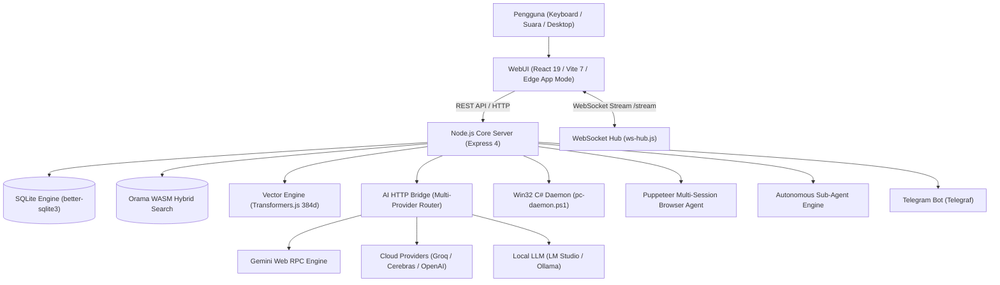

# Dokumentasi Teknis & Arsitektur Sistem MARK

_Metacognitive Artificial Relational Knowledge_

Selamat datang di repositori dokumentasi arsitektur dan teknis sistem **MARK**. Dokumentasi ini dirancang sebagai panduan komprehensif bagi pengembang, kontributor open-source, dan arsitek sistem yang ingin memahami cara kerja internal, memperluas kemampuan, atau mengadopsi konsep MARK ke dalam sistem otonom mereka sendiri.

---

## 1. Filosofi & Gambaran Umum

MARK adalah sistem operasi kecerdasan buatan otonom (_Autonomous AI OS Companion_) yang berfokus pada privasi (_privacy-first_), bekerja secara lokal di lingkungan desktop pengguna (Windows 10/11), dan dirancang dengan arsitektur terdesentralisasi:

- **Decoupled Architecture**: Memisahkan backend server berbasis Node.js ESM murni dengan antarmuka pengguna WebUI modern (React 19 / Vite 7 / Tailwind CSS 4) yang berjalan di Microsoft Edge App Mode.
- **Centralized Local Storage**: Seluruh riwayat percakapan, memori relasional, dokumen, task, dan sub-agent disimpan secara terpusat di engine SQLite lokal (`~/.config/mark-agent/mark.db`) dengan mode WAL (_Write-Ahead Logging_).
- **Hybrid AI Engine**: Mendukung inferensi lokal tanpa batas via LM Studio / Ollama, cloud API berkecepatan tinggi (Groq, Cerebras, Custom OpenAI-compatible), dan Google Gemini Web RPC engine bawaan.
- **Autonomous Multi-Agent System**: Memiliki mesin Sub-Agent independen (_Mission Control_) dengan isolasi sesi browser Puppeteer konkuren, tanpa batasan giliran (_no maxTurns limit_).
- **Deep Desktop & Web Automation**: Otomasi Win32 via daemon C# persisten untuk kontrol mouse/keyboard tingkat rendah, serta otomasi browser dengan parsing DOM interaktif (maksimal 80 elemen).
- **Zero Cloud Leak Audio Pipeline**: Transkripsi suara latensi rendah berbasis Web Speech API lokal, Background Wake Word watchdog ("Hey Mark" / "Mark"), dan sintesis suara Edge-TTS streaming.

---

## 2. Peta Navigasi Dokumentasi

Dokumentasi ini dibagi menjadi 7 kategori utama yang saling terhubung:

### [01. Getting Started](./01-getting-started/overview.md)

Panduan permulaan bagi pengembang yang baru pertama kali menyentuh proyek MARK.

- [Arsitektur & Konsep Dasar](./01-getting-started/overview.md): Pemahaman sistem decoupled, fondasi teknologi, dan filosofi privasi.
- [Panduan Instalasi & Dependensi](./01-getting-started/installation.md): Persiapan environment Node.js 20+, dependensi native C++, dan variabel konfigurasi.
- [Quickstart & Panduan Eksekusi](./01-getting-started/quickstart.md): Menjalankan MARK via CLI (`bin/mark.js`), antarmuka WebUI, dan monitor terminal.

### [02. Architecture & Database](./02-architecture/system-design.md)

Bedah arsitektur internal backend, komunikasi IPC, dan penyimpanan basis data.

- [Desain Sistem & Komunikasi IPC](./02-architecture/system-design.md): Alur request HTTP REST, WebSocket `/stream`, dan dynamic port manager.
- [SQLite & Client DB Proxy](./02-architecture/state-and-database.md): Struktur 12 tabel relasional, auto-migration skema, dan transparent REST proxy `TableProxy`.
- [Vector Engine, Search, & Context](./02-architecture/search-and-memory.md): Embeddings lokal Transformers.js (384d), Orama WASM, dan Context Manager compaction.

### [03. Agent Engine & Cognitive Brain](./03-agent-engine/react-loop.md)

Jantung pemikiran AI, ReAct loop, dan orkestrasi multi-agent.

- [ReAct Loop & Intent Routing](./03-agent-engine/react-loop.md): Siklus Thought-Action-Observation, SSE streaming, dan pemilihan tool dinamis.
- [Autonomous Multi-Agent Sub-Agents](./03-agent-engine/multi-agent-subagents.md): Mission Control, spawn/wait subagents, dan isolasi sesi browser.
- [Durable Agent Tasks](./03-agent-engine/durable-tasks.md): Alur kerja multi-langkah persisten dengan verifikasi artifact dan auto-retry.
- [Persona, Relational Growth, & Awareness](./03-agent-engine/persona-and-relationships.md): Evaluasi 4D trait (warmth, trust, sarcasm, energy) dan awareness engine.

### [04. Automation & Tools](./04-automation-and-tools/native-tools-registry.md)

Sistem otomasi desktop, manipulasi berkas, dan penjelajahan web.

- [Native Tools Registry & Plugins](./04-automation-and-tools/native-tools-registry.md): Peta komposisi tool, registry facade, dan sistem plugin eksternal.
- [Windows PC Automation Daemon](./04-automation-and-tools/pc-automation.md): Komunikasi IPC dengan C# Win32 daemon, SendInput Unicode, dan window tracking.
- [Browser Automation Engine](./04-automation-and-tools/browser-automation.md): Multi-session Puppeteer, DOM parser 80 elemen, blocking overlay, dan Holo preview.

### [05. Voice & Multimodal](./05-voice-and-multimodal/voice-pipeline.md)

Interaksi suara dan penglihatan komputer tingkat lanjut.

- [Voice Activity Detection & STT](./05-voice-and-multimodal/voice-pipeline.md): Web Speech API, watchdog wake-word tanpa livelock, zero-latency Web Audio chime, dan Edge-TTS.
- [Vision & Camera Pipeline](./05-voice-and-multimodal/vision-and-camera.md): Inspeksi frame webcam, normalisasi gambar Base64, dan routing analisis visual.

### [06. Security & Integrations](./06-security-and-integrations/security-and-approval.md)

Model izin keamanan, whitelist, dan integrasi pihak ketiga.

- [Security Gate & Tool Approval](./06-security-and-integrations/security-and-approval.md): 4-tier model (Reject, Once, Session, Always), Auto Mode (YOLO), dan Whitelist Management.
- [Telegram Bot Bridge](./06-security-and-integrations/telegram-bot.md): Kendali jarak jauh via bot Telegraf, otorisasi admin, dan remote approval.
- [Google Workspace Integration](./06-security-and-integrations/google-workspace.md): Alur OAuth2 lokal untuk Google Drive, Calendar, dan Gmail.

### [07. Developer Guide & Extensibility](./07-developer-guide/codebase-walkthrough.md)

Panduan teknis bagi pengembang yang ingin memodifikasi atau berkontribusi.

- [Codebase Walkthrough](./07-developer-guide/codebase-walkthrough.md): Peta struktur direktori, tanggung jawab berkas, dan konvensi penamaan.
- [Pembuatan Tools, Skills, & Plugins](./07-developer-guide/creating-skills-and-plugins.md): Tutorial step-by-step membuat tool baru dan menghubungkannya ke ReAct loop.
- [Troubleshooting & Gotchas](./07-developer-guide/troubleshooting-and-faq.md): Pemecahan masalah port lock (`EADDRINUSE`), database concurrency, dan audio session.

---

## 3. Konvensi & Standar Kode

- **Node.js ECMAScript Modules (ESM)**: Seluruh backend server menggunakan sintaks `import` / `export` standar ESM.
- **Strict Zero Emoji Rule**: Seluruh kode, respons AI, komponen antarmuka, dan dokumen teknis dilarang menggunakan karakter emoji.
- **Decoupled Renderer**: Berkas di dalam `src/renderer/` tidak boleh mengimpor modul native Node.js (`fs`, `path`, `child_process`). Semua operasi wajib melalui jembatan REST (`API_BASE`) atau WebSocket (`wsHub`).
- **Dynamic Connection**: Host dan port dideteksi secara dinamis via `SERVER_CONFIG` di `src/renderer/src/api/web-bridge.js`.
